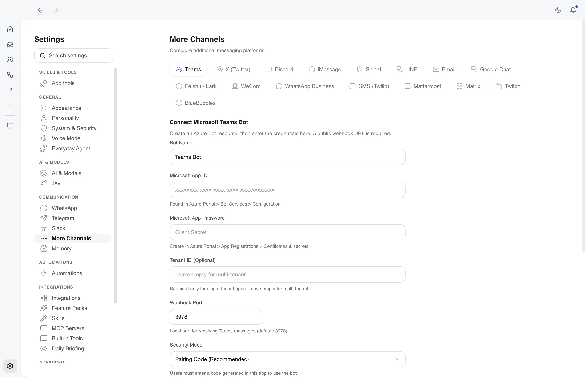
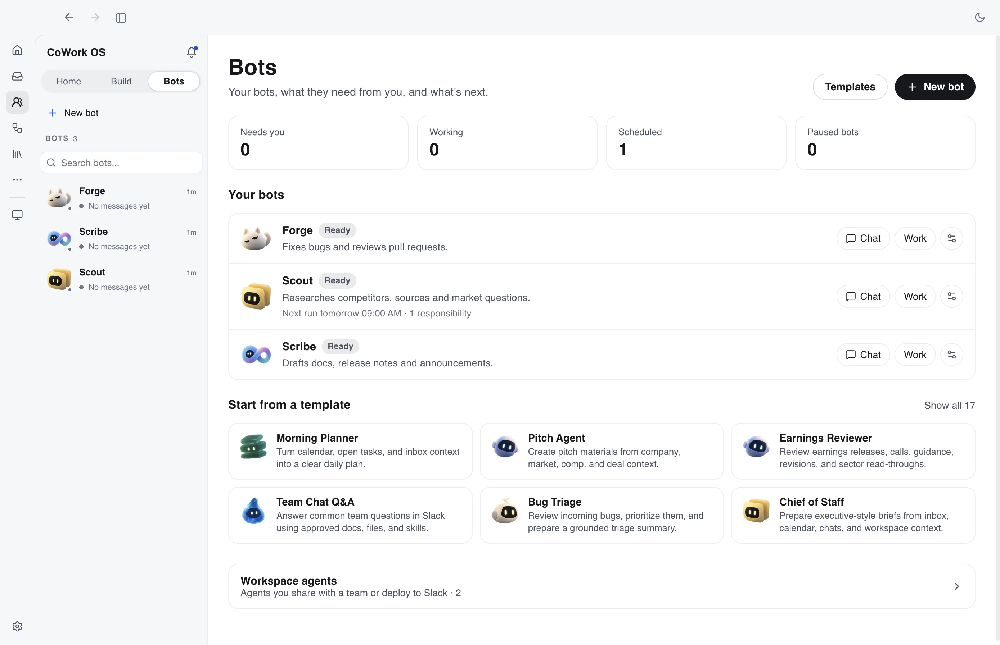
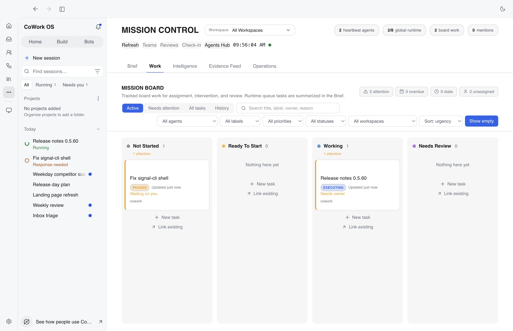
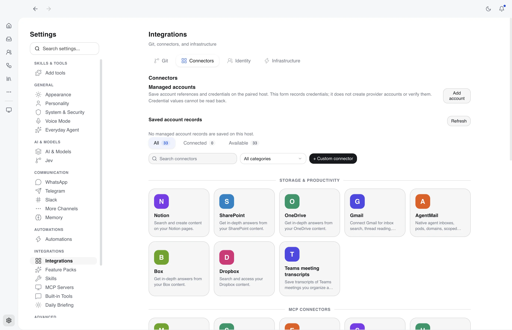

# Features

## Multi-Channel AI Gateway

Messaging channels share unified operations, plus per-channel, per-chat, and per-topic specialization for workspace, agent role, guidance, tool policy, and shared-memory opt-in. See [Channel Integrations](channels.md) for the current supported list and setup details, [Channel User Guides](channel-user-guides.md) for per-channel features and best practices, [Dedicated Channel Guides](channel-guides/) for separate channel pages, [Using CoWork from WhatsApp and Other Channels](gateway-user-guide.md) for end-user workflows, and [Gateway Message Lifecycle](gateway-message-lifecycle.md) for remote command routing, active-task behavior, delivery, and scheduled outputs.

<p align="center">
  
  <br><em>Channels can be configured with provider setup, routing, specialization, and security controls.</em>
</p>

- **WhatsApp**: QR code pairing, self-chat mode, markdown support, `/new` and `/new temp` task resets, `/stop` cancellation, editable progress delivery, and hidden temporary scratch workspaces
- **Telegram**: Bot commands, streaming responses, workspace selection, group routing modes, allowed-group allowlists, and group/topic specialization
- **Discord**: Slash commands, DM support, guild integration, guild allowlists, channel/thread specialization, embeds/polls/select menus, live message fetch and attachment download
- **Slack**: Socket Mode, channel mentions, file uploads, multiple workspace installations in one app profile, Slack-channel specialization, and optional curated middle-step progress relays
- **Microsoft Teams**: Bot Framework SDK, DM/channel mentions, adaptive cards
- **Google Chat**: Service account auth, spaces/DMs, threaded conversations
- **Feishu / Lark**: Webhook + app credential gateway support for Lark/Feishu tenants
- **WeCom**: Enterprise WeCom webhook and encrypted event routing support
- **iMessage**: macOS native integration, pairing codes
- **Signal**: End-to-end encrypted messaging via signal-cli
- **Mattermost**: WebSocket real-time, REST API
- **Matrix**: Federated messaging, room-based, end-to-end encryption ready
- **LINE**: Messaging API webhooks, 200M+ users in Asia
- **BlueBubbles**: iMessage via Mac server, SMS support
- **Email**: IMAP/SMTP, any email provider, threading
- **Research Channels**: Telegram and WhatsApp groups can be marked as link-research channels that auto-generate a structured findings report from posted URLs
- **Channel Specialization**: Gateway chats can resolve to admin-configured workspaces, agent roles, prompt guidance, tool restrictions, and shared-memory policy before new task creation

---

## Agent Capabilities

- **Profiles & Portability**: Separate app profiles isolate their own database, credentials, channels, skills, and sessions. Profiles can be exported/imported as bundles for migration or cloning.

- **Use-case gallery**: "See how people use CoWork OS" opens a gallery of ready-to-run prompts in three tabs (Tasks, Build, Bots), centered over the composer. Open it from the sidebar notice, the welcome screen, or Build. Clicking a card fills the composer, and skill-backed cards send their skill prompt.
- **GUI-first, CLI-capable AI Super App, Everything App, and Personal Agentic OS**: CoWork OS is a free, open-source, local-first super app for everyday AI work: coding, email, web design, research, documents, spreadsheets, presentations, automations, channels, devices, terminal tasks, and long-running work in one governed workspace.
- **Open Multi-Provider Harness**: Supported provider accounts, APIs, compatible gateways, cloud credentials, and local models can use the same CoWork tools, skills, memory, agents, approvals, artifacts, and workflows. CoWork itself is free and MIT-licensed; provider eligibility, limits, and charges remain separate. See [Model Providers](providers.md) and [Compare CoWork OS](comparisons/index.md).
- **MLX-LM Local Inference**: On native Apple Silicon Macs, the first-class **MLX (Apple Silicon)** provider runs quantized models through the local MLX-LM OpenAI-compatible server. Settings checks the native platform and Python imports, starts/stops the local server, shows download/loading logs, and routes normal agent requests through the shared provider interface. See [MLX-LM Local Inference](mlx-lm.md).
- **GUI-first Agent Management**: the Bots page, Mission Control, task timelines, visual boards, Teams, Devices, and Automations let users create reusable agents, spawn many parallel or specialized agents, inspect delegated runs, assign work, review approvals, and monitor outcomes through the desktop operator console.
- **CoWork CLI**: `cowork` opens an interactive terminal UI for local agent work, and `cowork run "task"` starts one-shot local tasks using the same local profile, providers, workspaces, skills, and MCP configuration as the desktop app. Normal local CLI use does not require a Control Plane token; `--remote` is the explicit remote client path. See [CoWork OS CLI](cli.md).
- **Governed Access Profiles**: The main composer offers Codex-style **Ask for approval**, **Approve for me**, **Full access**, and **Custom** profiles. A profile carries sandbox, approval, reviewer, network, filesystem, and domain policy across desktop, CLI, remote, managed, automation, and child-task surfaces. Command tools are derived from the selected profile; there is no separate new-task shell toggle. See [Access Profiles](access-profiles.md).
- **Everything Workbench**: Generated documents, spreadsheets, presentations, web pages, PDFs, and previews share one artifact model: compact output card, sidebar open, fullscreen artifact workspace, follow-up composer, and refresh after the agent completes requested edits. This makes CoWork the default place to create, inspect, and revise everyday Word/Excel/PowerPoint-style work while keeping external app actions available for advanced native workflows. See [Everything Workbench](everything-workbench.md).
- **Terminal Tabs**: CoWork now includes real xterm.js + node-pty terminal tabs inside the workspace, with native macOS login-shell behavior, Windows `cmd.exe` through ConPTY/winpty, keyboard shortcuts, Tab completion, Ctrl+C, interactive prompts, resizing, closeable tabs, and cwd-only prompts. This is a major super-app step because direct CLI work, repository work, agents, artifacts, browser testing, approvals, channels, and automations can stay in one governed workspace. See [Terminal Tabs](terminal-tabs.md).
- **Browser Workbench / Browser V2**: live website and local-app testing opens in a visible right-sidebar/fullscreen browser by default. Browser-use tools target the same webview the user can see through Browser V2, with responsive viewport testing through `browser_emulate`, accessibility snapshot refs, CDP-backed actions, tabs, diagnostics, screenshots, annotation, and visible cursor movement during agent actions. Explicit fallback modes include local Playwright, a separately launched Chrome with your system profile after consent, and Browser Use Cloud stealth browsers through `browser_provider: "browser-use-cloud"` for public HTTP(S) targets. See [Browser Workbench](browser-workbench.md) and [Browser V2 Architecture](browser-v2-architecture.md).
- **Task-Based Workflow**: Multi-step execution with plan-execute-observe loops
- **Task Overflow Actions**: task view title menus expose supported task actions in place: pin/unpin, rename, archive, copy working directory, copy task ID, copy `cowork://tasks/<taskId>` deeplink, copy Markdown, fork session, view outputs, and create a same-thread or new-task automation from the current task. See [Task Automations](task-automations.md).
- **Managed Agents**: **Workspace agents** on the Bots page (formerly Agents Hub) provides a dedicated surface for creating, inspecting, publishing, suspending, and improving reusable agents. Agent detail screens are configuration-first and single-pane: test, preview, and starter-prompt actions create normal runtime managed sessions and open their backing tasks in the main task window, where questions, responses, approvals, artifacts, and outputs are handled like any other task. See [Managed Agents](managed-agents.md).
- **Persistent Bots**: the **Bots** rail item opens the Bots page (what your bots need from you, what is running and scheduled, templates for new bots) and the bot roster. Bots give reusable agent roles a stable identity across many durable conversations, open or create dormant conversations, keep history separate from Sessions, support profile editing/deactivation, expose notification and host-computer state, and can take **responsibilities** (a trigger, sources, a mode, a review boundary and a budget; saved paused). Bots you add to a team you configure can message verified teammates; CoWork no longer installs a default bot team. See [Bots, conversations, and tasks](bots-and-conversations.md).
- **Runtime Orchestration**: SessionRuntime owns task-session state, session checklists, resume snapshots, recovery state, and task projection while the turn kernel handles each individual step, follow-up, or text turn; metadata-driven tool scheduling, graph-backed delegation, typed worker roles, verifier verdicts, semantic tool-batch summaries, and terminal-state reconciliation keep delegated work coherent across tasks, follow-ups, teams, and ACP runs.
- **Prompt-Aware Tooling**: visible tools receive concise prompt-local guidance after policy filtering, and planning plus execution share the same render source for compact tool text and provider-facing tool descriptions.
- **Composer Mentions**: type `@` in the main composer to choose Agents, configured Integrations, or Files. Integration mentions render as icon+name chips and add soft runtime routing guidance without changing permissions. See [Composer Mentions](composer-mentions.md).
- **Message Box Shortcuts**: type `/` in the main composer to search deterministic app commands and skill-backed workflow shortcuts in one picker. App commands include `/side`, `/schedule`, `/clear`, `/plan`, `/cost`, `/multitask`, `/compact`, `/doctor`, and `/undo`; `/side ...` opens a read-only side conversation about the selected running session, and `/schedule here ...` targets the selected thread for a scheduled follow-up. Plugin-pack aliases resolve to their target skills through the existing skills runtime. Skill-backed selections insert the command token so users can add context before sending. See [Message Box Shortcuts](message-box-shortcuts.md), [Side Chat](side-chat.md), and [Multitask Command](multitask.md).
- **Sectioned Prompt Stack**: execution and follow-up prompts are built from named session- and turn-scoped sections with explicit budgets, memoization of stable sections, provider-aware prompt caching, and truncation/drop reporting when token pressure rises.
- **Provider-Aware Prompt Caching**: CoWork keeps stable system blocks cacheable and dynamic turn context uncached, prefers Anthropic automatic caching where supported, uses explicit Claude breakpoints on OpenRouter, and derives stable OpenAI-family cache keys for GPT routes.
- **Mixture of Agents**: Settings can expose a virtual LLM provider where enabled presets run tool-free advisor models first and then hand bounded advisory context to a final aggregator model with the original tools. Presets support named advisor/aggregator slots, advisor output limits, concurrency, slot-level provider failover, and whole-preset failover when explicitly configured. See [Mixture of Agents](mixture-of-agents.md).
- **Jev Decision Support**: An optional structured-decision route can choose an agent team and leader for Collaborative mode and `/multitask`, route eligible foreground tasks between existing model profiles, choose bounded task strategies and lanes, and review selected higher-risk tool calls, using either the TypeSafe API or OpenRouter. Observe mode records evidence; Active mode escalates concerning reviews, keeps uncertain/unavailable observations advisory, and applies cost guards before expanding ordinary tasks. Jev tokens and provider cost are reported separately from LLM usage. See [Jev Decision Support](jev.md) and the [JEV harness validation record](jev-harness-validation.md).
- **OpenRouter Pareto Code Routing**: OpenRouter model selection includes `openrouter/pareto-code` and `openrouter/pareto-code:nitro`. When selected, Settings exposes OpenRouter's optional Pareto minimum coding score as a decimal from `0` to `1` so coding tasks can route by capability tier without pinning one concrete model.
- **Grok Account Routing**: xAI/Grok can run with either a direct xAI API key or a supported browser OAuth account connection. Available models, limits, and charges depend on xAI and the connected account; token refresh stays inside encrypted profile settings.
- **Session Checklist Primitive**: execution-style tasks can create a session-local ordered checklist with `task_list_create`, maintain it with `task_list_update`, inspect it with `task_list_list`, and surface it read-only in the task UI. The runtime can issue a non-blocking verification nudge when implementation items are done but no verification item exists yet.
- **Structured Delegation Briefs**: `spawn_agent` and `orchestrate_agents` resolve a worker role, package parent-step context plus evidence requirements into a structured brief, and apply the corresponding completion/tool contract to the child.
- **Permission Engine**: layered tool approvals combine access-profile boundaries, legacy modes, per-tool/path/command-prefix/MCP-server rules, session grants, workspace-local rules, profile rules, and hard guardrails; `dangerous_only` remains a compatibility mode while access profiles are the primary task-level choice.
- **Live Terminal Tabs**: Shell work can happen in real PTY-backed terminal tabs. xterm.js handles rendering and keyboard input, node-pty handles OS pseudoterminals, users can create/close tabs, resize the dock, use arrows/Tab/Ctrl+C, and interact with native CLI flows such as `npm login`. See [Terminal Tabs](terminal-tabs.md).
- **Dynamic Re-Planning**: Agent can revise its plan mid-execution
- **Bundled and Installable Skills**: GitHub, Slack, Notion, Spotify, Apple Notes, Unity, Unreal, Terraform, Kubernetes, financial analysis, and more. Bundled workflows include [LLM Wiki](llm-wiki.md) for persistent research vaults, [manim-video](skills/manim-video.md) for deterministic technical animation, [motion-film](skills/motion-film.md) and [motion-editor](skills/motion-editor.md) for code-rendered motion-design films and a local motion editor app, [architecture-design](skills/architecture-design.md) for Rhino/Blender/ComfyUI concept architecture workflows, [kami](skills/kami.md) for editorial PDFs and slide decks, [react-best-practices](skills/react-best-practices.md) for React and Next.js implementation work, [unbroker](skills/unbroker.md) for consent-gated data-broker cleanup, and `taste-skill` for high-agency frontend design. Optional CLI-based skills (e.g. [aurl](skills/aurl.md) for OpenAPI/GraphQL APIs) appear when the binary is installed.
- **Additive Skill Runtime**: Skills can still be proactively shortlisted from task semantics, but they now apply as additive context and scoped runtime directives. They never replace the original task prompt. See [Skills Runtime Model](skills-runtime-model.md).

<p align="center">
  
  <br><em>The Bots page turns reusable bots, templates and workspace agents into a first-class product surface.</em>
</p>

- **Ask (chat mode)**: Direct LLM chat with no tools by default, no step timeline, same-session follow-ups, chat-only streaming for supported providers, and a fixed high output budget for explicit `executionMode: "chat"` sessions. Uploaded PDF turns that need deeper document reading are narrowly promoted into read-only analysis so the document parser can run. See [Chat Mode](chat-mode.md).
- **Side Chat**: Right-side read-only questions about an active running session without steering or stopping the parent task. Side Chat uses a side-specific fork with hidden parent context, live parent-status snapshots for progress questions, a side-only visible transcript, and Markdown-rendered answers. See [Side Chat](side-chat.md).
- **Document Creation**: Excel, Word, PDF, PowerPoint, HTML, and React-style outputs with professional formatting, first-class LaTeX/TikZ `.tex` -> PDF compilation when a system TeX engine is installed, plus the bundled [kami](skills/kami.md) workflow for editorial PDFs, resumes, one-pagers, and slide decks
- **Document Artifact Workbench**: task-created Word-style files use compact artifact cards in the task feed. `.docx` opens directly into a resizable right-sidebar editor with a Google Docs-style toolbar, direct text editing, copy, save, external-open, and folder actions. `.doc`, `.rtf`, `.odt`, `.ott`, `.pages`, and related formats are recognized as document artifacts and use best-effort preview or external-app/folder actions depending on parser support. Fullscreen mode expands editable documents across the app and keeps a functional follow-up composer with the main task model picker, voice input, attachments, send behavior, latest-turn/working context, and automatic preview refresh after follow-up edits. See [Document Artifacts](document-artifacts.md).
- **Format-Aware File Preview Popup**: clicking a file link in chat opens a single in-app preview modal that adapts its layout, header metadata, and per-format affordances to the file type. Supported formats: HTML (sandboxed iframe), Markdown, code with `highlight.js` syntax highlighting, plain text, JSON / JSONL / GeoJSON (collapsible tree with raw/tree toggle and parse-error fallback), CSV / TSV (RFC-4180 quoted-field parser feeding a sortable-style table), XLSX, DOCX, PDF (with page/native-text/OCR summary and inline document surface), images (with fit/actual-size toggle, dimension readout, and an alpha checkerboard for PNG/SVG/WebP/GIF/ICO), video, audio (mp3/wav/ogg/m4a/flac/aac with duration metadata), and LaTeX. Modal width and padding are driven by a single `data-format` attribute, so HTML/PDF/image/video get more horizontal room while text/code stay compact and audio renders narrow. The header shows a format-specific subtitle (e.g. `PNG · 1920×1080 · 240 KB`, `PDF · 12 pages · 1.4 MB`, `CSV · 412 rows · 24 KB`) and a unified action bar — Copy path (with copied flash), Show in Finder, Open externally, Close — plus contextual buttons such as the image fit toggle and the JSON tree/raw toggle. Theme tokens replace the previously hardcoded modal background and PDF summary colors, so the popup renders consistently in light and dark themes.
- **Smart PDF Attachments**: uploaded PDFs are saved into the workspace and represented in the prompt with stable metadata: filename, workspace-relative path, page count, extraction mode/status, OCR/scan counts, and a compact excerpt. If the user asks about PDF contents beyond that excerpt, the runtime calls `parse_document` on the attached path instead of inlining the whole PDF. PDF excerpts are marked as untrusted document data so instructions inside the PDF cannot override the user or system prompt.
- **Bounded Long-Document Review**: direct read-only reviews of named `.docx`, `.pdf`, `.md`, and `.txt` sources use deterministic safe-file discovery, extraction, overlapping windows, complete coverage accounting, evidence reduction, and partial-success reporting. See [Long-Document Analysis](document-analysis.md).
- **Video Attachments**: uploaded `.mp4`, `.mov`, and `.webm` files are saved into the workspace, sampled into up to 10 representative frames, and sent to image-capable models as visual input. CoWork emits a contact sheet and representative full frame as timeline image artifacts under `.cowork/video-frames/...`, so the user can inspect the same screenshots the agent used. See [Video Attachments](video-attachments.md).
- **Spreadsheet Artifact Workbench**: task-created spreadsheet files use compact artifact cards in the task feed. `.xlsx`, `.xls`, `.xlsm`, `.csv`, and `.tsv` open a resizable right-sidebar spreadsheet viewer with sheet tabs, sticky headers, working zoom, cell/range/row/column selection, copy with a short `Copied` flash, inline editing, add row/column, and save back to the file. `.numbers`, `.gsheet`, `.ods`, and `.xlsb` are recognized as spreadsheet artifacts and use external-app/folder actions. Fullscreen mode expands editable sheets across the app and keeps a functional follow-up composer with the main task model picker, voice input, attachments, and send behavior. See [Spreadsheet Artifacts](spreadsheet-artifacts.md).
- **Presentation Artifact Workbench**: PPTX artifacts render as compact task-feed cards and open by default in the resizable right-sidebar presentation viewer. The viewer includes slide thumbnails, previous/next controls, zoom, a white slide canvas, extracted slide text, speaker notes, fast text-first loading, cached rendered slide images, fullscreen follow-up context, external-app/folder actions, and preview refresh after follow-up edits. Legacy PowerPoint formats are recognized with external actions. See [Presentation Artifacts and PPTX Preview](pptx-generation-and-preview.md).
- **Web Page Artifact Workbench**: generated `.html` / `.htm` files and built React output entrypoints render as compact task-feed cards and open by default in the resizable right-sidebar web viewer. The viewer uses a sandboxed iframe with local assets inlined where possible, browser/folder/copy actions, fullscreen follow-up context, and preview refresh after matching file/build-output updates. React-style projects without built output show a build-output-needed state instead of auto-starting a dev server. See [Web Page Artifacts](web-page-artifacts.md).
- **Browser Workbench / Browser V2**: live browser-use prompts such as "go to this site and test it as a normal user" open a shared in-app browser session beside the task. The agent can navigate, resize to desktop/tablet/mobile viewports, snapshot, click, fill, type, scroll, inspect diagnostics, upload/download files, screenshot, and annotate while the user watches the visible cursor and page state. See [Browser Workbench](browser-workbench.md).
- **Persistent Memory**: Cross-session memory in a local memory folder of markdown notes (git history, dreaming, optional sync and team memory), searchable archive recall, session transcript recall, privacy-aware observation capture, opt-in durable runtime context for compacted active-task recall, and an optional Supermemory external provider lane. See [Memory Engine](memory-engine.md)
- **Chronicle (Desktop Research Preview)**: opt-in local recent-screen context for vague prompts like `this`, `that`, `what is this`, `latest draft`, or `why is this failing`, with controls in Settings > Tools, pause/resume, promoted `screen_context` evidence, and optional linked background memory generation. See [Chronicle](chronicle.md).
- **Knowledge Graph**: SQLite-backed entity/relationship memory with FTS5 search, graph traversal, and auto-extraction
- **Workspace Kit**: `.cowork/` project kit + markdown indexing with context injection
- **Agent Teams**: Multi-agent collaboration with shared checklists, graph-backed coordinated runs, and team management UI
- **Collaborative Mode**: Auto-create ephemeral teams where multiple agents work on the same task, sharing thoughts in real-time through the delegated orchestration graph
- **Multitask Command**: `/multitask [N] <task>` starts a collaborative run from one prompt, auto-splits it into bounded lane-specific child tasks, respects the global queue limit, and synthesizes the lane outputs. See [Multitask Command](multitask.md).
- **Multi-LLM Mode**: Send the same task to multiple LLM providers/models simultaneously, with a judge agent synthesizing the best result
- **Workflow Pipeline**: Optional phase-based execution path where decomposed steps run as child tasks with per-phase LLM overrides or capability-based auto-selection
- **Agent Comparison Mode**: Compare agent or model outputs side by side
- **External Agent Orchestration**: Discover ACP agents, target local or remote assignees from orchestration tools, and invoke A2A-compatible remote endpoints behind the normal approval/policy layer; orchestration now flows through the shared graph engine and graph-backed task state
- **ACP Lifecycle Hardening**: ACP task state is persisted locally, survives restarts, supports remote cancel, and enforces scoped task/inbox access for non-operator clients
- **Sub-Task Navigation**: Open a delegated sub-task, inspect its timeline, then jump back to the parent task from the main content view
- **Git Worktree Isolation**: Tasks run in isolated git worktrees with automatic branch creation, auto-commit, merge, conflict detection, and cleanup
- **Task Pinning**: Pin important tasks in the sidebar for quick access
- **Wrap-Up Task**: Gracefully wrap up running tasks instead of hard-cancelling
- **Capability Matcher**: Auto-select the best agents for a task
- **Completion Output Confidence UX**: When tasks finish with file outputs, users get high-signal completion toasts with direct actions (`Open file`, `Show in Finder`, `View in Files`), automatic right-panel focus for the active task, unseen-output badges when reviewing another task/view, and richer completion text composed from semantic summaries plus verifier verdict/report when available.
- **Completion/Resume Coherence**: terminal task state is persisted before terminal events are emitted, and approval- or follow-up-driven resume paths re-check canonical persisted status before writing `executing`, preventing completed tasks from regressing to an in-progress row state.
- **Artifact-First Output Visibility**: Artifact-only tasks are treated the same as file-created outputs across progress, timeline, and Files panel surfaces.
- **Paired LaTeX/PDF Outputs**: Compiled LaTeX artifacts preserve the editable `.tex` source as the durable artifact and pair it with the generated PDF in one task workbench, including Summary, source, and PDF tabs.
- **Performance Reviews**: Score and review agent-role outcomes with autonomy-level recommendations
- **Vision**: Analyze workspace images via the active image-capable model/provider (OpenAI, Anthropic, Azure OpenAI, or Bedrock)
- **Image Attachments**: Attach images to tasks and follow-ups for multimodal analysis
- **Video Attachment Analysis**: Attach local MP4, MOV, or WebM videos to tasks and follow-ups. CoWork extracts visual evidence as still frames, shows those frames in the agentic timeline, and avoids unnecessary shell/glob probing for normal inspection requests.
- **Image Generation**: Multi-provider support (Gemini, OpenAI gpt-image-1/1.5/DALL-E, Azure OpenAI, OpenRouter) with configurable provider ordering
- **Video Generation**: Text-to-video and image-to-video via new video generation providers. Configure preferred video model in Settings > AI & Models. Generated videos render inline in the task feed.
- **Programmatic Technical Animation**: The bundled [manim-video](skills/manim-video.md) skill scaffolds Manim CE projects for math explainers, algorithm walkthroughs, architecture animations, and data stories with local project files, dependency preflight, and draft-first render helpers.
- **Motion-Design Films**: The bundled [motion-film](skills/motion-film.md) skill designs and renders launch videos, promos, feature announcements, explainers, brand openers, and social loops as one time-seeked HTML file rendered to MP4 with Playwright and ffmpeg — one continuous take, beat-synced to music, with a beat map and approval stills before the full build.
- **Motion Editor App**: The bundled [motion-editor](skills/motion-editor.md) skill builds a local, offline After Effects / Screen Studio-lite editor (scenes, layers, keyframes, springs, presets, stagger, cursor layer, timeline, undo/redo, save/open) with deterministic MP4 export and tests that must actually pass.
- **Architecture Design Orchestration**: The bundled [architecture-design](skills/architecture-design.md) skill coordinates local Rhino, Blender, and ComfyUI MCP connectors for concept architecture workflows, keeping briefs, manifests, model exports, renders, and photoreal passes inside a project root with connector evidence for each completed stage.
- **Editorial Document Design**: The bundled [kami](skills/kami.md) skill scaffolds workspace-local source projects for resumes, one-pagers, white papers, letters, portfolios, diagrams, and slide decks, with PDF/PPTX render helpers and a preserved editorial design system.
- **React/Next.js Implementation Guidance**: The bundled [react-best-practices](skills/react-best-practices.md) skill applies React and Next.js performance guidance during feature work, enhancements, refactors, reviews, data-fetching changes, bundle-size checks, and rendering-performance fixes.
- **Personal Data Broker Cleanup**: The bundled [unbroker](skills/unbroker.md) skill handles authorized data-broker and people-search exposure cleanup with recorded consent, a local PII ledger, opt-out/deletion queues, consolidated human-task digests, and recurring rechecks. It is not used for unauthorized OSINT, stalking, skip tracing, public-record deletion, or legal advice.
- **High-Agency Frontend Design**: The bundled `taste-skill` workflow adds a stricter anti-slop frontend option for React/Next.js-style UI work, with stronger layout variance, typography, motion, dependency-check, and responsive-quality rules than the default frontend guidance.
- **Visual Annotation**: Iterative image refinement with the Visual Annotator
- **Context Summarization**: Automatic context compression surfaced in the task timeline
- **Structured Input Requests**: In plan-mode flows, the agent can pause with 1-3 short multiple-choice questions instead of asking ambiguous free-text follow-ups
- **Parallel Tool Timeline**: Concurrent read-only tool bursts are grouped into lane-based timeline cards instead of flooding the event feed; screenshot-heavy refinement loops stay more compact in summary mode
- **Renderer Performance**: In the `CoWork-OS/CoWork-OS` repo, the renderer uses `@chenglou/pretext` for text-heavy sidebar/timeline measurement, with flattened visible sidebar rows and post-render height reconciliation for expanded timeline cards
- **Adaptive Runtime Recovery**: Main interactive tasks no longer receive implicit strategy turn caps. They use explicit-only window caps, bounded follow-up recovery, retry-aware turn guidance, and lifetime/emergency safety-stop escalation instead of default hard-window failure
- **Session Snapshot Resume**: SessionRuntime prefers `session_runtime_v2` checkpoint and event payloads, falls back to legacy `conversationHistory` payloads or event-derived history, and rewrites legacy resumes to V2 on the next checkpoint
- **Workspace Rule Manager**: Settings can list and remove workspace-local permission rules directly, and approval prompts can persist new workspace or profile rules with explicit reasons and scope previews.
- **Path Drift Repair**: `/workspace/...` aliases and drifted relative paths can be normalized back into the active workspace or pinned task root, with strict-fail policies when hard enforcement is preferred
- **Action-First Planning**: Agent prioritizes direct action over excessive pre-planning
- **Operator Runtime Visibility**: Task completion now surfaces the learning progression, unified recall spans tasks/messages/files/workspace notes/memory/KG, persistent shell sessions keep operator state, and live provider routing/fallback decisions are visible in the task UI and Mission Control.
- **Voice Calls**: Outbound phone calls via ElevenLabs Agents
- **Think With Me Mode**: Socratic brainstorming mode that helps clarify thinking without executing tools. Activated via toggle or auto-detected from brainstorm/trade-off patterns.
- **Problem Framing Pre-flight**: Complex tasks show a structured problem restatement, assumptions, risks, and approach before execution begins
- **Graceful Uncertainty**: Agent expresses uncertainty honestly and rates confidence on recommendations. Low-confidence messages display with an amber indicator.
- **AI Playbook**: Auto-captures successful patterns (approach, outcome, tools) and lessons from failures with error classification (7 categories: tool failure, wrong approach, missing context, permission denied, timeout, rate limit, user correction). Time-based decay scoring deprioritises stale entries. Proven patterns reinforced on repeated success. Mid-task user corrections automatically detected and captured. Relevant entries injected into system prompts. There is no separate settings page; a task's learning progression shows what was captured.
- **Evolving Agent Intelligence**: The agent visibly improves over time through a connected set of subsystems — layered memory, retry-aware recovery reuse, adaptive style learning, playbook-to-skill promotion, channel persona adaptation, and evolution metrics. See [Evolving Agent Intelligence](evolving-agent-intelligence.md).

### LLM Wiki Research Vaults

CoWork includes `llm-wiki` as a bundled first-class research-vault workflow inspired by Andrej Karpathy's LLM Wiki concept.

- **Persistent vaults**: creates workspace-local markdown knowledge bases instead of one-off research outputs
- **Obsidian-friendly structure**: durable notes, maps, `[[wikilinks]]`, source-preserving `raw/` captures, and filed-back `outputs/`
- **Deterministic workbench**: bundled runtimes handle raw ingest, vault-first search, slide/chart rendering, and graph analysis
- **Deterministic maintenance**: bundled analyzer reports topology, orphan pages, broken links, ambiguous links, weakly linked pages, bridge pages, surprising cross-section links, and suggested follow-up questions
- **GUI-first and slash-friendly**: natural prompts like `Build a persistent research vault for GRPO papers` route into `llm-wiki`, and `/llm-wiki` remains available in desktop and supported gateway channels. The optional welcome-screen vault browser is off by default and can be enabled from **Settings > Appearance > Home widgets > Show research vault**.
- **Run artifacts + durable state**: each run writes an inspectable manifest and graph report while keeping the vault itself persistent in the workspace

See [LLM Wiki](llm-wiki.md) for command syntax, layout, modes, and analyzer behavior.

### Desktop Location

Cross-platform location access for nearby-place, walking-distance, and local-errand queries. Use `get_current_location` to obtain the user's desktop coordinates before calling the Maps MCP connector for nearby search or route calculation.

| Platform    | Provider                    | How it works                                                                              |
| ----------- | --------------------------- | ----------------------------------------------------------------------------------------- |
| **macOS**   | Core Location               | Compiled Swift helper with `com.apple.security.personal-information.location` entitlement |
| **Windows** | Windows.Devices.Geolocation | Bundled PowerShell script using WinRT API                                                 |
| **Linux**   | GeoClue2                    | Bundled Bash script using `gdbus` over system D-Bus                                       |

- **One-time permission**: Each request prompts the user via the OS permission dialog. Location access cannot be auto-approved or persisted across tasks.
- **Accuracy modes**: `precise` (GPS/Wi-Fi best) or `coarse` (city-level)
- **Timeout**: Configurable 1–60 seconds (default 15s). Failed requests are cached for 2 minutes to prevent retry storms.
- **Maps integration**: Coordinates feed into `maps.search_places`, `maps.rank_nearby_options`, and `maps.route` from the bundled Maps MCP connector.

### Computer use

Desktop automation for **native apps** on macOS and Windows when MCP, browser automation, and shell are not enough. **Full guide:** [Computer use](computer-use.md).

- **Session lifecycle**: One active computer-use session at a time; global **Esc** abort; cleanup when the task finishes or the session ends.
- **Platform helpers**: macOS uses helper-targeted Accessibility and Screen Recording permissions; Windows v1 controls visible, non-minimized windows through a bundled Win32 helper.
- **Built-in tools category**: Enable/disable and priority for the `computer_use` tool family alongside other built-in categories.
- **Policy & planning**: Tool availability defers the computer-use lane unless the task signals native/desktop GUI intent; executor guidance treats computer use as last resort after integrations, `browser_*`, and shell. For native GUI tasks, routing prefers **`screenshot`**, **`click`**, **`type_text`**, **`keypress`**, and related tools (plus **`open_application`** when launching the app) over **`run_applescript`** / fragile shell GUI hacks.
- **Tools**: `screenshot`, `click`, `double_click`, `move_mouse`, `drag`, `scroll`, `type_text`, `keypress`, `wait` (with blocklisted dangerous key chords).

### Chronicle (Desktop Research Preview)

Chronicle is the desktop-only recent-screen context lane for underspecified on-screen references.

- **Controls in Tools**: Chronicle is configured from `Settings > Tools > Chronicle` (Memory's Connections section links there), with consent gating, pause/resume, capture scope, Screen Recording / Accessibility / OCR status, and recent-buffer status
- **Dedicated Chronicle tool lane**: `screen_context_resolve` now lives in its own `chronicle` built-in tool category instead of piggybacking on `computer_use`
- **Screen-context resolution**: `screen_context_resolve` searches recent local frames first and only falls back to a fresh local screenshot when passive context is weak
- **No second memory system**: raw passive frames are ephemeral; only task-used observations are promoted into `.cowork/chronicle/`, unified recall, and optionally linked `screen_context` memory entries
- **Mission Control visibility**: promoted observations appear as `screen_context` evidence, a dedicated learning-progress step, and recall hits
- **Task-level control**: task creation in the main composer and Devices panel can disable Chronicle for one task without changing the global setting
- **Privacy boundary**: passive capture stays local, screen-derived text is marked untrusted, and Chronicle-backed promotion can respect workspace memory privacy/auto-capture settings

See [Chronicle](chronicle.md) for setup, testing, privacy, and contributor details.

### Inbox Agent

Local-first inbox workspace for email triage, normal email handling, follow-up, task capture, cross-channel identity, and operator handoff.

- **Classic + Today modes**: the familiar three-pane inbox remains available, while Today groups work into `Needs action`, `Happening today`, `Good to know`, and `More to browse`
- **Live inbox surfaces**: `Unread`, `Needs reply`, `Suggested Actions`, and `Open Commitments`
- **Mailbox views**: `Inbox`, `Sent`, and `All`, with `Recent` and `Priority` sorting, saved views, account filters, and domain filters
- **Normal email actions**: manual reply, reply-all, forward, To/Cc/Bcc, editable subject/body, and provider-backed send
- **AI draft review**: generated replies can be edited before sending, and the draft card clears after successful send
- **Ask Inbox**: right-sidebar mailbox chat with live agentic steps, final answers, matched email evidence, and click-to-open results
- **Hybrid mailbox search**: Ask Inbox searches local FTS, semantic mailbox embeddings, provider-native Gmail/Outlook search when available, and attachment text for statements, invoices, extracts, PDFs, payment notices, and similar evidence
- **`@Inbox` composer routing**: type `@Inbox` or `@inbox ...` in the main composer to open Inbox Agent, switch to Ask Inbox, and route the remaining query there
- **Action rail**: cleanup, follow-up, reply, forward, mark done, thread prep, todo extraction, scheduling, and intel refresh
- **Thread visibility**: received and sent message content are both shown in the thread detail view
- **Cross-channel replies**: reply directly via linked Slack, Teams, WhatsApp, Signal, or iMessage targets when email is not the best channel
- **Unified identity**: manual search/link in Settings can attach Slack, Teams, WhatsApp, Signal, iMessage, and CRM handles to one contact identity
- **Relationship timeline**: the research rail merges email and channel history into one relationship timeline with channel preference hints
- **Mission Control handoff**: threads can be turned into company issues, assigned to an operator, and woken from the inbox
- **Sender cleanup**: noisy senders are ranked by volume, cleanup candidates, and estimated weekly reduction
- **Inbox automations**: rules, reminder cadences, patrol schedules, and Gmail forwarding automations can create tasks, wake agents, and schedule review flows
- **Commitment handling**: accepted commitments become real follow-up tasks; already-handled threads can be marked done
- **Event pipeline**: mailbox sync, triage, draft, send, and action events feed Knowledge Graph, Heartbeat, triggers, playbooks, and briefing
- **Safer review**: sensitive-content warnings, editable drafts, blocked scripts, and provider-permission gates keep outbound actions visible before anything leaves the app
- **Local persistence**: cached mail remains visible after restart while background sync refreshes new mail

See the full workflow guide in [Inbox Agent](inbox-agent.md) and the retrieval/IPC contract in [Ask Inbox Architecture](ask-inbox-architecture.md).

### Managed Devices & Remote Operations

CoWork OS now includes a dedicated Devices tab for running and observing work across multiple machines.

- **Local + remote device inventory**: track the current machine alongside saved remote devices in one view
- **Connection-aware remote cards**: direct, SSH-tunneled, and Tailscale-backed devices expose connection state, last-seen time, active runs, storage summary, app summary, and attention state
- **Remote task dispatch**: start a task on a selected remote device with an access profile, execution mode, or multi-LLM options
- **Remote file picker**: browse remote workspaces and attach files directly from the target machine before dispatching a task
- **Remote task feed**: filter tasks for the selected device, all devices, or attention states, then open those tasks in a remote session view
- **Device overlays**: inspect apps, storage, resource signals, alerts, and observer history without leaving the Devices surface

See [Remote Access](remote-access.md) for connection patterns and [Mission Control](mission-control.md) for the company-level control surface.

### Automation Studio and Advanced Controls

Select **Automations** in the main sidebar to open Automation Studio. The main-screen Studio is the structured flow authoring and operations surface:

- **Discover**: describe an outcome, choose a proven template, or begin with a blank flow
- **Library**: inspect structured flows, enabled state, recent run state, step count, and update time
- **Builder**: configure one starter, ordered actions, typed variables, explicit Yes/No branches, workspace/account bindings, required Google scopes, reliability settings, dry runs, drafts, activation, manual runs, and turn-off controls
- **Activity**: inspect version-pinned runs and steps, attempts, redacted output, approvals, errors, cancellation, and backing tasks

Every activation is immutable. Saving a later draft cannot change the starter, account binding, secret references, actions, or limits used by the active version. The runtime adds a durable deduplicated event inbox, bounded execution, approval gates, cancellation propagation, restart recovery, sensitive-key redaction, and retention cleanup. See [Automation Studio](automation-studio.md).

Advanced and compatibility features remain grouped under `Settings > Automations`:

- **Routines**: prompt-based saved instructions plus execution target, triggers, outputs, approval policy, connector policy, and recent runs; structured Studio flows reuse the Routine shell but add a versioned graph and deterministic runtime
- **Workflow Intelligence**: Memory, Heartbeat, internal Reflection, Dreaming, and reviewable Suggestions form one always-on runtime owned by automation profiles
- **Task Queue**: concurrency, queueing, and background execution policy
- **Workflow Intelligence settings**: target-scoped evidence, hypotheses, critique, winner selection, suggestion dispatch, feedback learning, and guarded auto-create policy
- **Scheduled Tasks**: recurring time-based task execution; now also used as a compiled backend for routine schedule triggers, including task-sourced routines created from `Add automation...`
- **Webhooks**: inbound automation entry points; now also used as a compiled backend for routine API triggers
- **Event Triggers**: condition-based actions triggered by channel, webhook, or runtime events; now also used as a compiled backend for routine event triggers
- **Daily Briefing**: scheduled summaries with workspace, memory, and evolution context

Ownership model:

- `Mission Control` is the cockpit around the core runtime
- main-sidebar `Automation Studio` is the primary visual multi-step flow surface
- `Routines` remain the saved automation shell and the prompt-based compatibility surface
- `Scheduled Tasks`, `Webhooks`, and `Event Triggers` remain low-level or generated infrastructure
- `Triggers` are ingress and normalized evidence only
- `Devices` are execution routing only

The home dashboard also surfaces recent automation runs. Use main-sidebar **Automations → Activity** for structured step-level evidence, or the advanced Settings pages for prompt-based routines and compiled backends. See [Core Automation](core-automation.md).

Task view can also create a task-sourced routine from the selected task with `... > Add automation...`. The popup is prefilled from the task title/prompt, keeps the source task reference and `cowork://tasks/<taskId>` deeplink, continues the same thread by default, and compiles schedule/API/event triggers to the lower-level cron, webhook, or event engines as needed. See [Task Automations](task-automations.md).

### Routines

`Routines` are the compatibility shell for saved automation in CoWork OS. Use main-sidebar Automation Studio for a structured multi-step graph; use **Settings → Automations → Routines** for prompt-based instructions and lower-level policy/target configuration.

Each routine can carry:

- one saved instruction block
- one execution target (`workspace`, `worktree`, `device`, or `managed_environment`)
- one or more triggers
- one or more outputs
- a connector policy (`prefer` or enforced `allowlist`)
- an approval policy
- durable run history

Supported trigger types include:

- `schedule`
- `api`
- `connector_event`
- `channel_event`
- `mailbox_event`
- `github_event`
- `manual`

Current product stance:

- use Automation Studio first when you want a visual, deterministic, multi-step flow with testing, variables, branching, approvals, and versioned activation
- use prompt-based `Routines` when one saved instruction block and its execution target/policy are the right abstraction
- use `Scheduled Tasks`, `Webhooks`, or `Event Triggers` directly only when you intentionally want the lower-level surface
- treat `Workflow Intelligence` as the always-on cognitive runtime, not as a routine trigger

### Company Ops

CoWork OS can also be configured as a founder-directed autonomous company shell by composing several existing systems into one operating loop:

- **Venture operator workspace kit**: initializes `.cowork/` with `COMPANY.md`, `OPERATIONS.md`, `KPIS.md`, `PRIORITIES.md`, and `HEARTBEAT.md`
- **Automation profiles**: always-on ownership for the chosen operator roles
- **Heartbeat v3 follow-up**: automation-profile-backed operators can proactively review recurring checks defined in `HEARTBEAT.md`, while cheap Pulse cycles stay non-LLM until escalation is justified
- **Strategic planner**: turns company goals, projects, and stalled work into planner-managed issues and optionally auto-dispatches them into tasks
- **Mission Control ops view**: exposes planner config, planner runs, goals, projects, issues, linked tasks, issue comments, and run events
- **Autonomy policy integration**: operator roles can carry reusable autonomy presets instead of relying on one global all-or-nothing mode

This workflow is designed for "human-directed, agent-operated" execution:

- humans define business goals, guardrails, and irreversible approval policy
- agents continuously create, route, and execute operational work
- Mission Control becomes the monitoring and intervention cockpit

### Workflow Intelligence

`Workflow Intelligence` is the primary always-on cognition layer in CoWork OS:

- **Memory as source of truth**: reflection outputs become memory candidates such as preferences, workflow patterns, open loops, corrections, recurring tasks, and ignored noise
- **Heartbeat as scheduler**: Heartbeat decides when accumulated signals justify reflection
- **Dreaming as memory curation**: about once a day (offered by idle Heartbeat pulses) or on **Dream now**, Dreaming tidies the memory folder; safe edits to agent-written notes are one undoable commit, and anything touching your own notes waits in **Settings > Memory > Review**
- **Reviewable suggestions first**: useful outcomes appear in the automation inbox and Suggestions panel. The optional welcome-screen **Next actions** widget is off by default and can be enabled from **Settings > Appearance > Home widgets > Show next actions**.
- **Global coordinator, namespaced targets**: one coordinator ranks work globally while each workflow target keeps its own history, winner, backlog, and dispatch stream
- **Stable target identities**: supports core-owned targets such as `global`, `workspace`, `agent_role`, `code_workspace`, and `pull_request`
- **Fixed reflective pipeline**: collect evidence, generate 3-5 hypotheses, critique them, synthesize one winner, write backlog, and create a suggestion by default
- **Feedback learning**: act/edit/snooze/dismiss/ignore responses update memory and future scoring
- **Durable artifacts plus SQLite indexing**: compatibility files are written under `.cowork/subconscious/` and indexed for UI/search/filtering
- **Guarded downstream execution**: auto-created tasks require explicit policy, low risk, clear scope, and trusted or repeatedly accepted patterns
- **Recommendation-only success path**: if no executor mapping exists or policy does not allow autonomy, the run still completes with a reviewable suggestion or deferred recommendation
- **No maintainer-only enrollment gate**: safety remains enforced by the existing executor approval and capability policies

See [Workflow Intelligence](workflow-intelligence.md) and [Dreaming](dreaming.md) for the architecture and memory-curation guidance.

### Core Harness

The always-on runtime now includes a learning loop around core traces:

- failure mining
- recurring failure clustering
- living eval cases
- gated experiments
- promoted learnings

Mission Control exposes this through the `Core Harness` view. See [Core Automation](core-automation.md).

### Reliability Flywheel

Reliability is built as a continuous loop: capture failures -> replay deterministically -> gate risky completions -> harden nightly/release workflows.

| Reliability Capability      | What It Does                                                                                                           |
| --------------------------- | ---------------------------------------------------------------------------------------------------------------------- |
| **Eval Corpus (local)**     | Converts failed/partial tasks into replayable eval cases stored in local SQLite                                        |
| **Deterministic Replay**    | Re-runs eval suites to catch regressions before they reappear in production usage                                      |
| **Risk-Based Review Gate**  | Scores task risk (`low`/`medium`/`high`) and escalates review/verification only when justified                         |
| **Policy Modes**            | `off`, `balanced`, and `strict` review policies for domain-appropriate guard strength                                  |
| **Skill/Prompt Hardening**  | Uses modular prompt sections, explicit token budgets, and skill shortlist routing to reduce drift and context overload |
| **PR Reliability Contract** | Enforces “production failure fix must add/update eval case” in CI                                                      |
| **Nightly Hardening**       | Runs eval + battery loops nightly, produces grouped and machine-readable artifacts                                     |
| **Release Gate**            | Applies hardening checks before release with a date-based stability-window promotion                                   |
| **Local-Only Data Policy**  | Keeps reliability artifacts local; no required telemetry upload path                                                   |

See [Reliability Flywheel](reliability-flywheel.md) for architecture, schema, scripts, IPC endpoints, CI workflows, and operational commands.

### Work Choice and Runtime Overrides

The composer presents two work choices. **Ask** handles conversation and supplied content without external actions. **Do** lets CoWork select a task strategy. In the current runtime contract, Ask maps to the `chat` interaction value and Do maps to `smart`. **Advanced…** exposes the execution overrides below; these are runtime options beneath Do, not additional first-level work choices.

| Advanced override | Runtime behavior                                                                                                                                             |
| ----------------- | ------------------------------------------------------------------------------------------------------------------------------------------------------------ |
| **Execute**       | Full task execution path with tools, planning, and artifacts.                                                                                                |
| **Plan**          | Structured planning path; can pause for `request_user_input` when structured human input is enabled and is intended for non-mutating planning/coordination. |
| **Analyze**       | Read-only analysis path that stays evidence-focused and blocks mutating tools.                                                                               |
| **Debug**         | Focused debugging path for diagnosis and repair.                                                                                                              |
| **Verified**      | Execute-like path that adds external verification checks after steps before completion.                                                                      |

Runtime behavior is separate from [access profiles](access-profiles.md). The
work choice selects conversation or task handling; an advanced override pins a
runtime strategy; the profile selects the sandbox, approvals, reviewer,
command-tool, filesystem, network, and domain boundary. A choice or orchestration
control cannot widen the selected profile.

> **Note:** Verified is useful when execution should include an explicit verification gate. Plan can request structured user input; it does not bypass approvals.

### Task Toggles

The task creation UI also includes higher-level toggles that change how tasks are orchestrated:

| Toggle                | Behavior                                                                                                                                                                                                                     |
| --------------------- | ---------------------------------------------------------------------------------------------------------------------------------------------------------------------------------------------------------------------------- |
| **Autonomous**        | Legacy/reduced-friction task toggle that can auto-approve eligible actions and suppress optional user-input pauses within the effective access profile. It cannot add tools, widen profile scope, or bypass hard guardrails. |
| **Check-ins**         | Opts a fresh task into legacy clarification pauses. Keep this off for Codex/Claude Code-style execution that chooses safe defaults and stops only for hard blockers.                                                         |
| **Collaborative**     | Auto-creates an ephemeral team of agents that analyze the task from multiple perspectives, then a leader synthesizes the results. Phases: dispatch → think → synthesize → complete.                                          |
| **Multitask command** | Type `/multitask [N] <task>` to create a fresh collaborative run that splits the prompt into lane-specific child tasks before synthesis. Defaults to 4 lanes, bounded to 2-8.                                                |
| **Multi-LLM**         | Sends the same task to multiple LLM providers/models in parallel. A designated judge model synthesizes the best result. Requires 2+ providers configured.                                                                    |
| **Think With Me**     | Socratic brainstorming mode — agent asks follow-up questions and explores trade-offs without executing tools. Read-only tools only.                                                                                          |

> **Note:** Autonomous mode shows a confirmation dialog before enabling. It is
> not a replacement for the access selector: choose **Full access** explicitly
> when a trusted task needs that profile, and remember that export, location,
> hard-guardrail, administrator, and explicit-deny boundaries still apply.

### Ask (Chat Mode)

**Ask** (stored as the `chat` execution mode; labelled **Chat** before 0.5.60) is the direct assistant conversation surface. It is designed for normal Q&A, not task execution.

- **No tools by default**: the assistant does not plan or call tools in normal chat mode
- **PDF exception**: chat turns with uploaded PDF attachment metadata are auto-promoted to read-only analysis when deeper PDF content is needed, so `parse_document` can read the file without enabling mutating tools
- **No step timeline**: chat turns do not render execution steps
- **Same-session follow-ups**: later questions stay in the current conversation thread
- **Explicit only**: chat behavior is enabled only when `executionMode` is explicitly set to `chat`
- **High output budget**: explicit chat sessions use a fixed 48K target output cap, clamped to the active provider budget
- **History strategy**: long chat sessions use a summary-plus-recent-window prompt strategy with cached summary reuse

See [Ask (Chat Mode)](chat-mode.md) for the full behavior contract.

### Side Chat

Side Chat is the right-side companion conversation for an active running session. It is designed for inspection and clarification while the parent task continues.

- **Launch from `/side`**: type `/side` or `/side <question>` in the main composer while a task is selected
- **Side-only transcript**: the panel shows only side-chat questions and answers, not the cloned parent prompt or earlier parent answers
- **Hidden parent context**: the side task can inherit read-only parent transcript/runtime context for answering questions without exposing copied events in the panel
- **Fresh status answers**: status/progress questions receive a live parent-status snapshot for that turn, including current parent task state, active runtime state, timeline/checklist information, recent parent events, and result/error summaries when available
- **Non-steering boundary**: side questions do not modify parent instructions, approve tools, cancel work, or change the active queue
- **Read-only chat execution**: side tasks run with chat execution mode, command tools disabled, worktree creation off, autonomous mode off, and tools denied
- **Markdown rendering**: side answers render Markdown, including inline code, lists, and fenced code blocks

See [Side Chat](side-chat.md) for the user contract and implementation landmarks.

When the agent is operating in plan-mode execution, it can also use `request_user_input` to pause for structured multiple-choice decisions. Responses are persisted locally and can be submitted from either the desktop UI or the Control Plane web dashboard. Normal execute-mode tasks default to safe assumptions plus concrete blocker reporting instead of broad clarification check-ins.

### Guided Decisions & Runtime Recovery

The runtime now includes a set of decision and recovery contracts aimed at keeping tasks convergent without hiding failures:

| Capability                        | Behavior                                                                                                                                                                                                                                                                                                                                                |
| --------------------------------- | ------------------------------------------------------------------------------------------------------------------------------------------------------------------------------------------------------------------------------------------------------------------------------------------------------------------------------------------------------- |
| **Structured input requests**     | `request_user_input` asks 1-3 concise multiple-choice questions, pauses the task, and resumes after submit/dismiss. Available in plan/debug mode when the task human-input policy allows structured input.                                                                                                                                              |
| **Explicit turn-window recovery** | Main interactive tasks run without an implicit turn window. If a caller, managed template, or helper explicitly sets `maxTurns` or `windowTurnCap`, the runtime applies the requested `turnBudgetPolicy`, soft-logs exhausted adaptive windows, reserves space for finalization, and allows bounded follow-up recovery before triggering a safety stop. |
| **Context overflow retry**        | Context-capacity errors trigger compaction plus retry instead of immediate hard failure when the model context window is exceeded.                                                                                                                                                                                                                      |
| **Workspace alias repair**        | Absolute alias paths such as `/workspace/...` can be remapped into the active workspace for file and directory tools, or blocked via `strict_fail`.                                                                                                                                                                                                     |
| **Pinned task-root repair**       | Relative paths that drift outside the task's canonical root can be rewritten back under the pinned root, retried with a bounded budget, or rejected under strict policy.                                                                                                                                                                                |
| **Parallel tool-lane rendering**  | Parallel read-only tool groups are projected into stable lane rows in the timeline so summary mode stays readable.                                                                                                                                                                                                                                      |

---

## Plugin Packs & Customize

Role-specific and workflow bundles that group skills, agent roles, connectors, and slash commands into installable packs. Each pack targets a job function or workflow area.

- **35 bundled packs**: Engineering, Engineering Management, Product Management, DevOps, Mobile Development, Game Development, Data Analysis, QA & Testing, Sales CRM, Customer Support, Content & Marketing, Technical Writing, finance packs, Claude-for-Legal practice packs, Geo SEO, and CoWork Shortcuts
- **100+ pack skills and shortcuts**: Code review prep, sprint health, feature triage, incident response, prospect research, DCF modeling, LBO analysis, `/strategy`, `/batch-rename`, `/gmail-summary-drive`, `/multi-source-report`, and more
- **Unified Customize panel**: Browse, enable/disable packs, view skills/commands/agents, click "Try asking" prompts
- **Search & filter**: Real-time sidebar search across pack names, descriptions, categories, and skill names
- **Per-skill toggles**: Enable or disable individual skills within a pack without toggling the entire pack
- **Persistent state**: Pack and skill toggle states survive app restarts (stored in `pack-states.json`)
- **Recommended connectors**: Packs display clickable connector chips that navigate to connector settings
- **Update detection**: Background check against the remote registry with orange dot indicators on packs with newer versions
- **"Try asking" in chat**: Empty chat state shows randomized prompt suggestions from enabled packs for one-click task creation
- **Message-box slash aliases**: Plugin-pack `slashCommands` appear in the main `/` picker and invoke their mapped skill IDs. Selecting skill-backed aliases inserts the slash token so the user can add context before sending. Alias enable/disable state follows pack and per-skill toggles.
- **Claude-for-Legal workflow cards**: Legal pack commands are editable from the slash picker and can show structured main-view matter-context cards. `/litigation-legal-demand-intake` gets a dedicated demand-letter intake card; other matter-heavy legal workflows get a generic legal details card. See [Claude-for-Legal Workflows](claude-for-legal.md).
- **Plugin Store**: In-app marketplace for discovering, installing, and creating packs (from Git repos, URLs, or scaffold)
- **Managed import scanning**: Git and URL pack installs are staged and scanned before activation, with install results surfaced as installed, installed with warning, or quarantined
- **Quarantine & report UX**: blocked imported packs move into a dedicated quarantine area with stored reports, retry scan, and removal actions in the Customize panel
- **Warning-only local detection**: unmanaged local pack folders remain discoverable in v1, but security findings can surface as warning badges and report details
- **Remote Pack Registry**: Community-contributed packs catalog with search and category filtering
- **Extensible**: Create custom packs with JSON manifests in `~/.cowork/extensions/`
- **Active Context sidebar**: Always-visible right-panel section showing connected MCP connectors with branded Lucide icons for every shipped connector and enabled skills, with scrollable sub-sections and 30-second auto-refresh
- **Skill conflict detection**: Warns when multiple packs register the same skill ID, preventing silent overwrites
- **Admin Policies**: Organization-level controls for allowed/blocked/required packs, installation permissions, and agent limits

Access from **Settings** > **Feature Packs**. See [Plugin Packs](plugin-packs.md) for pack management and [Message Box Shortcuts](message-box-shortcuts.md) for the composer shortcut model.

---

## Skill Store & External Skills

CoWork OS supports external skill installation through the desktop GUI, not just bundled skills or CoWork-native packs.

- **CoWork Registry tab**: Browse curated skills distributed through CoWork’s own registry flow
- **ClawHub tab**: Search ClawHub directly from the app, view live skill stats, and install from result cards
- **Popular ClawHub list**: Opening the ClawHub tab with no query shows the top downloaded public ClawHub skills
- **External import field**: Install skills from Git repositories, ClawHub page URLs, raw JSON manifests, or raw `SKILL.md` URLs
- **Managed install path**: Imported skills are staged, scanned, and then copied into CoWork’s managed skills directory only when activation is allowed
- **Security outcomes**: installs now return installed, installed with warning, or quarantined, with summary text surfaced directly in the Skill Store UI
- **Quarantine & report UX**: blocked imported skills move to a dedicated quarantine area with stored reports, retry scan, and removal actions
- **Optional external directories**: Add one or more absolute read-only skill folders in Settings so shared team skills can load without being copied into CoWork
- **Warning-only local discovery**: optional external skill directories are not auto-quarantined in v1, but CoWork can still surface unscanned or warning-state badges and reports for those bundles
- **Clear precedence**: Workspace skills override managed installs, managed installs override external directories, and external directories override bundled defaults
- **Cross-ecosystem support**: Other external skill stores are supported when they expose Git repos, raw manifests, or raw `SKILL.md` bundle entry points
- **Shared runtime contract**: Once loaded, external skills follow the same additive execution model as bundled skills. They can add context and scoped directives, but they cannot replace the canonical task prompt.

Access from **Settings** > **Skills** > **Skill Store**. Users can start with bundled global skills such as `llm-wiki`, `kami`, `react-best-practices`, `unbroker`, and `taste-skill`, then add third-party skills through the same runtime model. See [Skill Store & External Skills](skill-store-and-external-skills.md) for install/import behavior and [Skills Runtime Model](skills-runtime-model.md) for execution semantics.

---

## Admin Policies (Enterprise)

Organization-level policy controls for managing plugin packs, connectors, and agents across teams.

| Policy Area                | Capabilities                                                                                    |
| -------------------------- | ----------------------------------------------------------------------------------------------- |
| **Pack policies**          | Allow, block, or require specific packs by ID. Whitelist mode restricts to approved packs only. |
| **Connector policies**     | Block specific MCP connectors                                                                   |
| **Agent policies**         | Set max heartbeat frequency (min 60s) and max concurrent agents per workspace                   |
| **Installation controls**  | Toggle custom pack creation, Git-based install, URL-based install                               |
| **Organization directory** | Distribute admin-managed packs from a shared directory to all users                             |

**Policy enforcement:**

- Blocked packs appear disabled in the Customize panel and cannot be enabled
- Required packs cannot be disabled by users
- Installation policies block scaffold, Git install, and URL install at the handler level
- Organization packs load from a configurable shared directory

Access from **Settings** > **Admin Policies** (Power density mode). See [Admin Policies](admin-policies.md) for full documentation.

---

## Voice Mode

Talk to your AI assistant with voice input and audio responses.

| Feature                  | Description                                                                  |
| ------------------------ | ---------------------------------------------------------------------------- |
| **Text-to-Speech**       | ElevenLabs (premium), OpenAI TTS, or local Web Speech API                    |
| **Speech-to-Text**       | OpenAI Whisper for accurate transcription                                    |
| **Multiple Voices**      | ElevenLabs voices or OpenAI voices (alloy, echo, fable, onyx, nova, shimmer) |
| **Outbound Phone Calls** | Initiate calls via ElevenLabs Agents                                         |

| Provider       | TTS              | STT           | Cost              |
| -------------- | ---------------- | ------------- | ----------------- |
| **ElevenLabs** | Yes (premium)    | —             | Pay-per-character |
| **OpenAI**     | Yes              | Yes (Whisper) | Pay-per-token     |
| **Local**      | Yes (Web Speech) | Coming soon   | Free              |

Configure in **Settings** > **Voice**.

---

## Persistent Memory System

| Feature                               | Description                                                                                                                                                                                                                                                                                                                                                        |
| ------------------------------------- | ------------------------------------------------------------------------------------------------------------------------------------------------------------------------------------------------------------------------------------------------------------------------------------------------------------------------------------------------------------------ |
| **Memory Folder** | Facts about you, your workspaces and lessons live in a local git repo of markdown notes (`~/CoWork Memory`), in the open [Agent Memory Repo](https://github.com/AgentMemoryRepo/agentmemoryrepo) format: `MEMORY.md` (in every prompt), `me.md`, `lessons.md`, one file per workspace, and an unreviewed `inbox.md` for what the agent saves after reading untrusted content. Every change goes through one writer (salience gate, secret redaction, dedupe, an agent never overwrites your lines) and is a commit. On for everyone; optional private sync and read-only team memory. [Design](memory-repo-phase1-design.md) |
| **Wake-Up Layers** | The runtime injects the memory folder's `MEMORY.md` and the workspace's file, `L0` (pinned profile and open commitments) and `L1` (memory relevant to the request); deep recall stays explicit through the memory tools |
| **Memory Tools** | `memory_recall` (one ranked search over saved facts, the archive, earlier conversations, `.cowork` notes, the memory folder, the knowledge graph and, when connected, Supermemory), `memory_remember` (facts into the memory folder, commitments and notes about other people into `memory_items`; `outcome`, `error` and `note` into the archive; available in every step), `swarm_note` (findings and questions shared by agents working on one goal), `memory_forget` (a real delete) and `context_recall` (the active task after compaction). The 16 earlier memory tools (`memory_save`, `memory_curate`, `search_memories`, `search_quotes`, `search_sessions`, `context_grep` and others) were removed after one release as hidden aliases |
| **Archive Memory** | `memory_remember` with kind `outcome`, `error` or `note`, task outcomes and feedback persist into the larger searchable archive lane for cross-session recall |
| **Structured Observations**           | Archive memories get inspectable sidecar metadata with title, narrative, facts, concepts, files, tools, source events, privacy state, and deterministic migration status                                                                                                                                                                                           |
| **Dreaming** | About once a day (or on **Dream now**), one model pass reads the memory folder and recent tasks, merges duplicates, removes stale notes, moves notes to better files and saves what you told CoWork. Safe changes are one commit you can undo; anything touching your own notes, `MEMORY.md` or the inbox waits in **Review**, and you get a notification. Commitment expiry closes finished commitments on the same schedule. [Design](memory-repo-phase2-design.md) |
| **Progressive Recall** | `memory_recall` returns a compact ranked index (snippet, relevance, token estimate, provenance); a second call with `ids` and `detail: "full"` reads only the selected results |
| **Durable Runtime Context** | Optional task-scoped runtime recall stores sanitized task messages and source-linked compaction summaries, which `context_recall` searches and expands for active-task facts after compaction. [Guide](durable-runtime-context.md) |
| **Checkpoint Capture**                | Runtime-native checkpoints are written before compaction, on non-trivial task completion, and every 12 meaningful exchanges, each carrying both a structured summary and a verbatim evidence packet                                                                                                                                                                |
| **Conversation Recall** | `memory_recall` with scope `conversations` searches the workspace conversation index of earlier tasks (the active task is excluded by default; `context_recall` covers it) |
| **Memory Hub** | **What CoWork knows** lists the memory folder's notes by file (edit, delete, pin, open file, keep from the inbox) plus commitments and notes about other people; **Review** shows dream proposals as diffs with accept, reject and undo; **Sources** shows where memory comes from, with imported memories and Chronicle observations; **Health** runs the memory health checks; **Settings** has five short sections (this workspace, memory folder, import, connections, proactive) and a collapsed **Advanced**. Each chat reply has a **Memory used** toggle |
| **Memory Write Governance** | Optional approval modes (`COWORK_MEMORY_WRITE_APPROVAL_MODE`) can stage durable writes before commit for headless or controlled runs; the normal app commits immediately and has no approval queue in the UI |
| **Supermemory Provider** | Optional external provider lane with prompt-time profile injection, an `external` scope in `memory_recall` / `memory_remember` / `memory_forget`, and optional mirroring of non-private `MemoryService.capture(...)` writes. Remote ids are recorded, so local deletes forget the remote copy and "Disconnect & purge" removes every recorded copy |
| **Privacy Protection**                | Auto-detects sensitive patterns (API keys, passwords, tokens)                                                                                                                                                                                                                                                                                                      |
| **Unified Search** | `memory_recall` fuses memory items, archive memory (BM25 plus hashed local term vectors; no embedding model), conversations, the knowledge graph and indexed `.cowork/` markdown with weighted reciprocal-rank fusion |
| **AI Memory Compression** | On by default per workspace (**Settings > Memory > Settings > Advanced > Cost and storage**). Long archive memories get a one-line model summary and related ones a digest, on the configured provider's cheap model, within a daily budget of 20,000 tokens across workspaces (adjustable; the settings show the last 24 hours' use). It costs tokens; private rows, strict privacy mode and `<no-memory>` content never reach the model. Without it, summaries stay local: the first informative line, skipping constant preambles and tags. [Details](memory-engine.md#6a-archive-capture-summaries-and-compression) |
| **Prompt Defaults** | The memory folder block, `L0` and `L1` are injected by default; archive injection is off by default; deep recall stays explicit and tool-driven |
| **Temporal Knowledge Graph**          | Relationships can carry `valid_from` / `valid_to`, `kg_invalidate_edge` closes an active fact without deleting history, and historical reads can opt into `as_of`                                                                                                                                                                                                  |
| **ChatGPT History Import**            | Import your full ChatGPT conversation history to reduce cold start. Imported content stays local in SQLite and uses memory privacy filtering; selected sensitive settings/fields are encrypted separately. [Details below](#chatgpt-history-import)                                                                                                                |
| **Per-Workspace Settings** | Use memory, Learn from chats, Strict privacy, history retention and AI memory compression, in **Settings > Memory > Settings** |
| **Optional External Memory Provider** | Supermemory can be connected from **Settings > Memory > Settings > Connections** for prompt-time profile injection, an external recall lane, and optional mirroring of non-private local memory captures. [Guide](supermemory.md) |

**Privacy:** **Use memory** turns memory on or off for the workspace; **Strict privacy** keeps everything private (local and out of shared contexts). Sensitive data is redacted in both cases.

Inline privacy controls are also available during capture: `<no-memory>` disables automatic capture for that task content, and `<private>...</private>` redacts the marked segment from captured memory. Redacted and suppressed observations are excluded from prompt recall, and private/redacted/suppressed entries are not mirrored to Supermemory.

Supermemory is additive, not a replacement for local memory. CoWork still keeps the workspace kit, `memory_items` facts, archive memory, structured observation metadata, Dreaming proposals, conversation recall, and knowledge graph locally. Memory Write Governance can require approval before external writes or mirrors are committed; sensitive external-memory payloads are blocked rather than stored in the pending queue. The current integration mirrors local memory captures only when you opt in; it does not yet stream every chat turn into Supermemory conversations. See [Structured Memory Observations](memory-observations.md), [Dreaming](dreaming.md), [Workspace Memory Flow](workspace-memory-flow.md#memory-write-governance), and [Supermemory Integration](supermemory.md).

Configure in **Settings** > **Memory**.

---

## ChatGPT History Import

Import your full ChatGPT conversation history into CoWork OS's memory system. Instead of starting from scratch, the agent immediately understands your preferences, past projects, communication style, and context from hundreds or thousands of previous conversations.

### How It Works

1. **Export from ChatGPT**: Go to [ChatGPT Settings > Data Controls > Export Data](https://chat.openai.com/#settings/DataControls). OpenAI emails you a `.zip` file containing `conversations.json`.
2. **Import in CoWork OS**: Go to **Settings > Memory > Settings > Import** and choose **ChatGPT export** and select the exported `.zip` or `conversations.json` file.
3. **Processing**: Conversations are parsed, deduplicated, and stored as memory entries with full-text search indexing. User messages are captured as context; assistant responses are summarized for token efficiency.

### What Gets Imported

| Data                    | How It's Used                                                                                       |
| ----------------------- | --------------------------------------------------------------------------------------------------- |
| **Your messages**       | Stored as observations — reveals your interests, projects, preferences, and communication style     |
| **Assistant responses** | Summarized and stored as insights — captures decisions, recommendations, and solutions you received |
| **Conversation titles** | Indexed for semantic search — helps match relevant past context to new tasks                        |
| **Timestamps**          | Preserved for time-based relevance ranking — recent conversations weighted higher                   |

### Security & Privacy

- **Stored locally by default** — Imported history is written to the local SQLite database on your Mac. CoWork does not automatically upload or sync the full import as a separate dataset.
- **Local protected storage** — Imported history is stored in the local SQLite database; selected sensitive settings/fields use OS keychain/AES-backed encryption, while memory import content relies on local storage controls and privacy filtering rather than whole-file database encryption.
- **Privacy filtering** — The same auto-detection that filters API keys, passwords, and tokens from regular memories applies to imported history.
- **Scoped provider context** — Memory selection happens locally. When relevant snippets are included in a task prompt, they are sent to the model route selected for that task, just like the rest of the prompt. CoWork does not send the full imported archive unless a user explicitly places it in task context.
- **Deletable** — You can clear all imported memories at any time from **Settings > Memory > Sources**.

### Why This Matters

Most AI assistants start with zero context about you. Every new tool means re-explaining your preferences, projects, and constraints. ChatGPT history import eliminates this cold-start problem — CoWork OS learns from your existing AI conversations so it can be useful from the first task.

---

## Durable Learning Stack

CoWork OS still keeps a multi-layered learning stack under the reflective loop. These services improve recall, personalization, and future evidence quality across sessions.

| Layer             | Service                   | What It Learns                                                          |
| ----------------- | ------------------------- | ----------------------------------------------------------------------- |
| **Task Patterns** | PlaybookService           | Successful approaches, failure categories, error recovery strategies    |
| **Facts**         | MemoryWriter (memory folder; `memory_items` for commitments and people) | Preferences, identity, rules, project facts, decisions and corrections as notes in the memory folder; commitments and notes about other people in `memory_items` |
| **Archive**       | MemoryService             | Outcomes, decisions, errors, insights with hybrid lexical search        |
| **Feedback**      | FeedbackService           | Rejection patterns and preference corrections, saved as corrections in the workspace's memory folder file (`.cowork/MISTAKES.md` when the folder is off) |

**Key mechanisms:**

- **Error classification**: 7 categories for targeted recovery strategies
- **Confidence decay**: older playbook entries receive lower relevance scores (30d: 0.8x, 90d: 0.5x)
- **Reinforcement**: successful patterns are boosted via reinforcement memories
- **Mid-task correction detection**: regex-based detection of user corrections during execution
- **Retry-aware reuse**: retries can reuse playbook patterns during planning, recent session recall during planning/execution/follow-ups, and pending verification checklist state instead of restarting cold
- **`/learn` skill**: manually teach the agent insights, corrections, preferences, or rules

These layers feed `Workflow Intelligence` and the normal task runtime. Dreaming tidies the memory folder about once a day. See [Workflow Intelligence](workflow-intelligence.md) and [Dreaming](dreaming.md) for the full architecture guide.

### Evolving Agent Intelligence

A set of connected subsystems that make improvement visible and measurable over time.

| Subsystem                         | Purpose                                                                                                                                                                                                                                                                                    |
| --------------------------------- | ------------------------------------------------------------------------------------------------------------------------------------------------------------------------------------------------------------------------------------------------------------------------------------------ |
| **Layered Memory Runtime** | Uses explicit wake-up layers: the pinned `<cowork_user_profile>` block (or `<cowork_hot_memory>` on planning and chat) for `L0`, memory relevant to the request (`<cowork_relevant_memory>` or the plan step's memory section) for `L1`, and tool-driven `L2/L3` recall through `memory_recall` and `context_recall`. |
| **Retry-Aware Recovery Guidance** | When execution retries or resumes, injects retry count, retry reason/classification, pending verification items, and recent session evidence so the agent keeps moving from the last good state instead of restarting blindly. Planning retries can also include compact playbook context. |
| **Adaptive Style Engine**         | Observes message length, emoji usage, technical vocabulary, and structured feedback to gradually shift personality settings (response length, emoji usage, explanation depth), stored as an inferred `response_style` fact. Rate-limited to a configurable number of level-shifts per week; never overrides a style you set.                                             |
| **Playbook-to-Skill Promotion**   | When a playbook pattern is reinforced 3+ times, auto-generates a `skill_proposal` for admin review. No skill is created until explicitly approved.                                                                                                                                         |
| **Channel Persona Adapter**       | Applies channel-appropriate communication directives (Slack = terse/structured, email = formal/greeting+sign-off, WhatsApp = short/emoji, etc.) on top of the core persona without replacing it.                                                                                           |
| **Evolution Metrics**             | Computes 5 on-demand metrics: Correction Rate, Style Adaptations, Knowledge Graph growth, Task Success Rate, and Style Alignment. Produces an overall 0–100 Evolution Score. Surfaced in the Daily Briefing.                                                                               |
| **Daily Log Summarizer**          | Retired in memory repo Phase 3: the memory folder and its dreaming replace daily summaries ([design](memory-repo-phase3-design.md)). |

**Behavior Adaptation controls** (Settings > System & Security > Safety Limits > Behavior Adaptation):

- **Adaptive Style** toggle — enable/disable style learning (off by default)
- **Max drift per week** — maximum one-level style shifts per 7-day window (default: 1)
- **Reset learned style** — clears all accumulated style adaptations
- **Channel Persona** toggle — enable/disable per-channel communication adaptation (off by default)

See [Evolving Agent Intelligence](evolving-agent-intelligence.md) and [Behavior Adaptation](behavior-adaptation.md) for full details.

---

## Operator Runtime Visibility

CoWork OS now exposes the learning loop as a visible operator surface instead of leaving it buried inside background services.

| Surface                       | What users see                                                                                                                                                                                                                  |
| ----------------------------- | ------------------------------------------------------------------------------------------------------------------------------------------------------------------------------------------------------------------------------- |
| **Task learning progression** | A standardized post-task learning card showing memory capture, playbook reinforcement, skill proposal state, evidence links, and next action. The same event stream also feeds activity feeds and Mission Control task details. |
| **Unified recall**            | One “search everything” surface across tasks, messages, files, workspace notes, memory entries, and knowledge-graph context, with shared ranking/dedup logic for UI and prompt injection.                                       |
| **Persistent shell sessions** | Long-lived shell state per task/workspace with retained cwd, env deltas, aliases, reset controls, and one-shot fallback for incompatible commands.                                                                              |
| **Model routing visibility**  | Live active provider/model, routing reason, fallback chain, and retry/fallback state in the task UI and settings surfaces.                                                                                                      |
| **Applied skills visibility** | The task header keeps the canonical request visible and shows applied skills separately, including trigger/reason metadata from runtime events.                                                                                 |

This layer is intentionally additive. It makes learning and routing legible while preserving the desktop control plane, channels, inbox, devices, and governed automation that define CoWork OS.

See [Operator Runtime Visibility](operator-runtime-visibility.md) for the cross-surface implementation summary and [Skills Runtime Model](skills-runtime-model.md) for the skill-specific runtime contract.

---

## Knowledge Graph

SQLite-backed structured entity and relationship memory with full-text search and graph traversal.

| Feature                      | Description                                                                                                                                            |
| ---------------------------- | ------------------------------------------------------------------------------------------------------------------------------------------------------ |
| **10 built-in entity types** | person, organization, project, technology, concept, file, service, api_endpoint, database_table, environment                                           |
| **15 built-in edge types**   | uses, depends_on, part_of, created_by, maintained_by, deployed_to, and more                                                                            |
| **FTS5 search**              | Full-text search with BM25 ranking over entity names and descriptions                                                                                  |
| **Graph traversal**          | Iterative BFS up to 3 hops with edge type filtering                                                                                                    |
| **Observations**             | Append-only timestamped fact log per entity                                                                                                            |
| **Auto-extraction**          | Pattern-based extraction of technologies, file paths and API endpoints from completed task results (no LLM)                                            |
| **Confidence decay**         | Auto-extracted entities decay over time (floor: 0.3)                                                                                                   |
| **10 agent tools**           | kg_create_entity, kg_update_entity, kg_delete_entity, kg_create_edge, kg_delete_edge, kg_invalidate_edge, kg_add_observation, kg_search, kg_get_neighbors, kg_get_subgraph |
| **Recall and context**       | Reached through `memory_recall` (scope `knowledge`) and the `kg_*` tools; not injected into the default prompt (wake-up layers exclude it) |
| **Data quality**             | Case-insensitive entity names, precise technology extraction, no free-mail organizations or automated-sender people, source precedence (manual > agent > auto); automatic writes respect workspace memory settings and `<no-memory>` |

See [Knowledge Graph](knowledge-graph.md) for the full architecture guide.

---

## Workspace Kit (.cowork)

Initialize and maintain a `.cowork/` directory inside each workspace for durable, human-edited context, scoped prompt injection, project scaffolding, and workspace health checks.

The workspace kit is contract-driven: every tracked markdown file has a declared title, scope, parser, prompt budget, freshness window, mutability model, and optional special handling.

### Root workspace files

| File               | Title                  | Scope                                         | Parser         | Typical use                                                                             |
| ------------------ | ---------------------- | --------------------------------------------- | -------------- | --------------------------------------------------------------------------------------- |
| `AGENTS.md`        | Workspace Rules        | `task`, `main-session`                        | `sectioned`    | workspace-wide operating guidance and coordination rules                                |
| `MEMORY.md`        | Long-Term Memory       | `task`, `main-session`                        | `decision-log` | durable learnings and long-lived constraints                                            |
| `USER.md`          | User Profile           | `task`, `main-session`                        | `kv-lines`     | preferences, timezone, communication defaults                                           |
| `TOOLS.md`         | Local Setup Notes      | `task`, `main-session`                        | `sectioned`    | environment notes, common commands, local conventions                                   |
| `IDENTITY.md`      | Workspace Identity     | `task`, `main-session`, `role`                | `kv-lines`     | who the agent is and what it owns                                                       |
| `RULES.md`         | Operational Rules      | `task`, `main-session`, `role`, `company-ops` | `checklist`    | must/must-not behavior and approval defaults                                            |
| `SOUL.md`          | Workspace Persona      | `task`, `main-session`, `role`                | `sectioned`    | tone, collaboration style, pushback contract, accountability loop, execution philosophy |
| `VIBES.md`         | Current Operating Mode | `task`, `role`                                | `sectioned`    | what to optimize for right now                                                          |
| `MISTAKES.md`      | Recurring Mistakes     | `task`, `main-session`, `role`                | `decision-log` | recurring failure patterns and corrections                                              |
| `LORE.md`          | Durable Context        | `task`, `main-session`                        | `decision-log` | important historical decisions and background context                                   |
| `CROSS_SIGNALS.md` | Cross-Agent Signals    | `task`, `main-session`, `company-ops`         | `decision-log` | contradictions, risks, amplified opportunities                                          |
| `PRIORITIES.md`    | Current Priorities     | `company-ops`, `task`                         | `checklist`    | current priorities, owners, review dates                                                |
| `COMPANY.md`       | Company Context        | `company-ops`                                 | `sectioned`    | mission, offer, customer, constraints                                                   |
| `OPERATIONS.md`    | Operating Model        | `company-ops`                                 | `sectioned`    | auto-allowed actions, approvals, escalation paths                                       |
| `KPIS.md`          | Business Metrics       | `company-ops`                                 | `sectioned`    | metrics, targets, and guardrails                                                        |
| `BOOTSTRAP.md`     | Bootstrap Instructions | `bootstrap`                                   | `checklist`    | one-time onboarding checklist                                                           |
| `HEARTBEAT.md`     | Heartbeat Checklist    | `heartbeat`                                   | `checklist`    | recurring Heartbeat v3 checklist work                                                   |

### Project and role subdirectories

- Project-specific context lives under `.cowork/projects/<projectId>/`
- `CONTEXT.md` is the project-scoped task brief, decisions, and notes file
- `ACCESS.md` is the project-scoped access and boundary file for task and role usage
- Per-role persona files live under `.cowork/agents/<roleId>/`
- The health model also tracks supporting directories such as `.cowork/memory/`, `.cowork/memory/hourly/`, `.cowork/memory/weekly/`, `.cowork/projects/`, and `.cowork/agents/`

### Frontmatter, parsing, and injection

Tracked files can begin with simple frontmatter:

```md
---
updated: 2026-03-14
---
```

- `updated` is expected on files with freshness windows so the app can mark stale context correctly
- Bodies are sanitized and redacted before prompt injection
- Oversized files are truncated to each file's prompt budget and reported with a truncation warning
- Parsers are file-specific: `sectioned` for heading-based notes, `kv-lines` for filled key/value fields, `checklist` for rules and recurring lists, and `decision-log` for durable bullet-style history

### Special handling

- `BOOTSTRAP.md` is onboarding-only context, not a durable memory file
- When `BOOTSTRAP.md` is first present, CoWork OS records `bootstrapSeededAt` in `.cowork/workspace-state.json`
- When `BOOTSTRAP.md` is later removed, CoWork OS records `onboardingCompletedAt` and does not recreate it during missing-only init flows
- `HEARTBEAT.md` is reserved for recurring Heartbeat v3 checklist work and is intentionally separate from general task/session context

### Health, linting, and revisions

- The app surfaces workspace-kit health with missing tracked entries, stale files, warning/error counts, revision counts, and onboarding metadata
- `ACCESS.md` and `TOOLS.md` receive additional secret detection to catch likely credentials or copied tokens
- Tracked writes keep snapshots under `.cowork/**/.history/<file>/` together with revision metadata
- `memory_recall` (scope `knowledge`) searches indexed `.cowork/` markdown alongside the main memory system
- `npm run kit:lint` validates the current workspace kit from the command line
- `npm run kit:lint -- --json` emits raw status JSON
- `npm run kit:lint -- --strict` exits non-zero on warnings or missing tracked entries

### Quick-open kit files

The **Workspace kit** group (**Settings > Memory > Settings > Advanced**) has **Open USER.md**, **Open MEMORY.md** and **Open DESIGN.md** buttons that open the corresponding `.cowork/` file directly in the system editor. If the file does not exist it is created from a default template (with full frontmatter and section scaffolding) before opening.

Configure in **Settings** > **Memory**.

---

## Role Profile Files

Define per-role personality and operating guidelines in `.cowork/agents/<role-id>/`. These files reuse the same contracts, parser rules, and titles as the root workspace kit, and role/task prompts can combine role files with root workspace files when scopes match.

| File          | Title                  | Purpose                                                                                 |
| ------------- | ---------------------- | --------------------------------------------------------------------------------------- |
| `IDENTITY.md` | Workspace Identity     | role identity, ownership boundaries, confirmation rules                                 |
| `RULES.md`    | Operational Rules      | role-specific must/must-not behavior and safety defaults                                |
| `SOUL.md`     | Workspace Persona      | collaboration style, tone, pushback contract, accountability loop, execution philosophy |
| `VIBES.md`    | Current Operating Mode | current emphasis, urgency, and optimization target                                      |

---

## Agent Teams

| Feature                    | Description                                                                                   |
| -------------------------- | --------------------------------------------------------------------------------------------- |
| **Team Management**        | Create and manage teams with multiple agent members                                           |
| **Persistent Teams**       | Mark teams as persistent so they survive across sessions with a default workspace             |
| **Shared Checklists**      | Agents share checklist items for coordinated task execution                                   |
| **Run Tracking**           | Track team runs with status, progress, and history                                            |
| **Collaborative Mode**     | Ephemeral teams with real-time thought sharing                                                |
| **Multitask Command**      | One-shot ephemeral team runs with auto-planned independent lanes from `/multitask [N] <task>` |
| **Multi-LLM Mode**         | Dispatch same task to multiple providers with judge-based synthesis                           |
| **Collaborative Thoughts** | Real-time thought panel shows agent reasoning as it happens                                   |

Configure in **Mission Control** > **Teams**.

---

## Mission Control

Centralized agent orchestration and monitoring dashboard. Open **More > Mission Control** from the left icon rail, in both the standard and Calm interfaces. Availability and exact routes vary by release; see the [release surface reference](release-surface-reference.md). The surface separates Heartbeat-enabled agents, the global runtime queue, and workspace-scoped Mission Board work so users can tell whether an item is monitoring, waiting to execute, or tracked on the board.

<p align="center">
  
  <br><em>Mission Control shows global runtime queue state, scoped board work, agent status, and operational review.</em>
</p>

| Panel                    | Purpose                                                                                                                                                       |
| ------------------------ | ------------------------------------------------------------------------------------------------------------------------------------------------------------- |
| **Agents**               | Heartbeat-enabled agents with status dots, Pulse/Dispatch state, automation-profile-backed cadence, idle/running labels, and manual trigger controls          |
| **Global Runtime Queue** | Executor queue summary for tasks currently running or waiting for an execution slot; this matches the chat/right-panel queue and may include other workspaces |
| **Mission Board**        | 5-column tracked-work Kanban board (Inbox → Assigned → In Progress → Review → Done) with drag-and-drop                                                        |
| **Feed & Details**       | Real-time activity feed with event type and agent filters, plus task detail view with comments and mentions                                                   |
| **Core Harness**         | Runtime traces, failure clusters, evals, experiments, and learnings                                                                                           |

**Header controls:** Agent Teams management, Performance Reviews, Standup Report generation, and workspace selector with live stats for Heartbeat agents, global runtime queue, board work, and pending mentions.

All panels update in real-time via event subscriptions — no manual refresh needed.

**Dispatched Agents Progress:** When you mention agents in a task prompt (e.g. `@Security Analyst review this codebase`), the parent task's main window shows a live progress panel with:

- Agent chips showing each dispatched agent's status (working/completed/failed)
- Phase indicator (Dispatched → Working → Complete)
- Real-time event stream from all child agent tasks (plans, steps, results)
- Click any agent chip to jump to that agent's full task view

Cancelling a parent task automatically cascades to all dispatched child tasks.

See [Mission Control](mission-control.md) for the full guide.

---

## Build Mode

Dedicated "idea → working prototype" workflow powered by Live Canvas with four phases:

| Phase        | Description                                                               |
| ------------ | ------------------------------------------------------------------------- |
| **Concept**  | Restate the idea, identify core requirements, choose tech stack           |
| **Plan**     | Break down into components, define file structure, outline implementation |
| **Scaffold** | Generate working code, push to canvas, create checkpoint                  |
| **Iterate**  | Refine based on feedback, add features, polish UI                         |

Each phase creates a named checkpoint. You can revert to any phase, diff between phases, and view the full phase timeline. Build Mode is available as a built-in skill (`build-mode`).

See [Live Canvas](live-canvas.md) for the full guide.

---

## Usage Insights

Dashboard showing task activity, cost trends, agent efficiency, and productivity patterns. Access from **Settings** > **Usage Insights**.

Usage Insights reads local usage data. **CoWork Pulse** is a separate, explicitly opt-in daily
aggregate collector with controls in onboarding, **Settings → CoWork Pulse**, and
`cowork telemetry`. It reports coarse usage to `pulse.coworkosapp.com` without task content.
The independent update check has no installation identifier. See [CoWork Pulse](cowork-pulse.md)
for data fields, consent/deletion behavior, metric definitions, and current limitations. This
analytics feature is also separate from the Heartbeat v3 operator feature called Pulse.

### Overview

The panel opens with a **hero stats row** showing four key metrics at a glance:

| Stat             | Description                                                                                                       |
| ---------------- | ----------------------------------------------------------------------------------------------------------------- |
| **Completed**    | Total tasks completed in the selected period                                                                      |
| **Success Rate** | Percentage of completed tasks out of total, with a color-coded progress bar (green ≥ 70%, amber ≥ 40%, red < 40%) |
| **Failed**       | Total failed tasks                                                                                                |
| **Avg Time**     | Average completion time across completed tasks                                                                    |

Below the hero row, detailed sections are arranged in a **two-column grid** for information density.

### Workspace Filtering

The workspace dropdown at the top lets you filter insights to a single workspace or view **All Workspaces** (the default). "All Workspaces" aggregates metrics across every workspace, giving you a global view of your agent usage.

### Sections

| Section                    | Description                                                                                                             |
| -------------------------- | ----------------------------------------------------------------------------------------------------------------------- |
| **Cost & Tokens**          | Total cost, input/output token counts, cached-token totals, cache-read rate when available, and cost breakdown by model |
| **Agent Efficiency (AWU)** | Agentic Work Unit metrics — see below                                                                                   |
| **Activity by Day**        | Tasks per day-of-week with peak day indicator                                                                           |
| **Activity by Hour**       | Hourly task histogram with peak hour indicator                                                                          |
| **Top Skills**             | Most-used skills ranked by usage count                                                                                  |
| **Skill Usage by Pack**    | Skills grouped by their parent plugin pack with aggregated usage counts and mini bar charts                             |
| **Persona Performance**    | Per-persona totals, success/failure mix, retry behavior, and cost attribution                                           |
| **Feedback & Quality**     | Feedback satisfaction rate, top rejection reasons, retried-task count, and average attempts                             |

### Agentic Work Units (AWU)

Inspired by [Salesforce's AWU concept](https://www.salesforce.com/agentforce/agentic-work-unit/), an **Agentic Work Unit** represents one successfully completed unit of agent work.

**Definition:** 1 AWU = 1 task with `status = 'completed'` AND `terminal_status` of `ok` or `partial_success`.

The AWU section shows:

| Metric               | Description                                                                                                                                    |
| -------------------- | ---------------------------------------------------------------------------------------------------------------------------------------------- |
| **AWU Count**        | Number of completed work units in the period                                                                                                   |
| **Tokens per AWU**   | Total tokens consumed ÷ AWU count (lower is more efficient)                                                                                    |
| **Cost per AWU**     | Total cost ÷ AWU count (lower is cheaper)                                                                                                      |
| **AWUs per Dollar**  | AWU count ÷ total cost (higher is better ROI)                                                                                                  |
| **Efficiency Trend** | Percentage change in tokens/AWU and cost/AWU vs the previous period. A downward arrow (green) means improvement; upward (red) means regression |

The trend comparison uses the same period length — e.g., if you're viewing a 7-day window, it compares against the prior 7 days. The AWU section is hidden when no tasks were completed in the period.

### Period Selection

Supports **7-day**, **14-day**, and **30-day** windows. Per-pack analytics cross-reference skill usage with plugin pack membership, showing which packs drive the most value.

---

## Daily Briefing

Proactive morning briefing combining:

- **Task summary**: Completed in last 24 hours, currently in progress, scheduled for today
- **Recent highlights**: Key insights and decisions from memory
- **Suggested priorities**: Based on user profile goals, or sensible defaults

Configurable as a scheduled task in **Settings** > **Scheduled Tasks** with time picker and channel delivery.

---

## Citation Engine

Automatic source attribution for web research. When agents use `web_search` or `web_fetch`, the Citation Engine tracks and deduplicates all referenced URLs, assigning sequential citation indices.

| Feature                     | Description                                                                          |
| --------------------------- | ------------------------------------------------------------------------------------ |
| **Auto-tracking**           | Intercepts results from `web_search` and `web_fetch` tools                           |
| **Deduplication**           | Same URL referenced multiple times gets a single [N] index                           |
| **System prompt injection** | Formatted citation list injected into LLM context so the agent can reference sources |
| **Citation panel**          | UI panel showing all sources with URL, title, domain, snippet, and access timestamp  |

Citations appear inline in agent responses as `[1]`, `[2]`, etc. and link to the source in the Citation Panel.

---

## Scratchpad Tools

Session-scoped note-taking system for agents during long-running tasks.

| Tool               | Description                                                                        |
| ------------------ | ---------------------------------------------------------------------------------- |
| `scratchpad_write` | Write or update notes with key-value pairs (max 100-char keys, 10,000-char values) |
| `scratchpad_read`  | Retrieve all notes or a specific note by key                                       |

Notes persist to `.cowork/scratchpad-{taskId}.json` for crash recovery. The scratchpad is ephemeral per task — useful for agents to track intermediate findings, partial results, and working state during complex multi-step tasks.

---

## Workflow Pipeline & Deep Work Mode

### Workflow Pipeline

Multi-phase task execution for complex workflows. The Workflow Decomposer detects multi-step prompts (using connectives like "then", "after that", "next", "finally") and splits them into sequential phases.

| Feature                  | Description                                                                  |
| ------------------------ | ---------------------------------------------------------------------------- |
| **Auto-detection**       | Regex-based decomposition of multi-phase prompts                             |
| **5 phase types**        | research, create, deliver, analyze, general                                  |
| **Sequential execution** | Each phase creates a child task; output pipes into the next phase            |
| **LLM fallback**         | Complex prompts that resist regex decomposition use LLM-powered splitting    |
| **Pipeline events**      | `pipeline_started`, `phase_started`, `phase_completed`, `pipeline_completed` |

### Deep Work Mode

Extended execution mode for complex tasks that need sustained focus:

- **Extended timeouts** — Deep work tasks get longer execution budgets
- **Progress journaling** — Agent records progress notes during execution, visible in the task timeline
- **Memory compression pause** — Memory service pauses background compression during active deep work to avoid context disruption

---

## Document Generation Tools

Four dedicated agent tools for generating formatted documents from task context:

| Tool                    | Output                      | Description                                                                                                                                                             |
| ----------------------- | --------------------------- | ----------------------------------------------------------------------------------------------------------------------------------------------------------------------- |
| `compile_latex`         | PDF + `.tex` source pairing | Compile a workspace `.tex` file with an installed system engine (`tectonic`, `latexmk`, `xelatex`, `lualatex`, or `pdflatex`) and register the PDF with source metadata |
| `generate_document`     | PDF                         | Generate PDF documents with markdown content and structured sections                                                                                                    |
| `generate_presentation` | PPTX                        | Generate PowerPoint presentations with multiple slides                                                                                                                  |
| `generate_spreadsheet`  | XLSX                        | Generate Excel spreadsheets with multiple sheets and data                                                                                                               |

These tools complement the existing document skills (spreadsheet.ts, document.ts, presentation.ts) by providing direct LLM-callable tool interfaces. Generated files are registered as task artifacts with proper MIME types.

Spreadsheet outputs also participate in the artifact workbench. Task completion cards, `file_created`, and `artifact_created` events can render the compact spreadsheet card for Excel, delimited, Numbers, Google Sheets shortcut, ODS, and XLSB outputs. Editable spreadsheet formats default to the right sidebar; native/app-owned formats open externally. Fullscreen mode preserves task follow-up context and filters the context panel to the current prompt after a follow-up starts. See [Spreadsheet Artifacts](spreadsheet-artifacts.md).

Word-style document outputs also participate in the artifact workbench. Task completion cards, `file_created`, `file_modified`, and `artifact_created` events can render the compact document card for DOCX, DOCM, DOTX, DOTM, DOC, RTF, ODT, OTT, and Pages outputs. DOCX defaults to the right-sidebar editor and can expand to fullscreen with follow-up context; other document formats use best-effort preview or external-open actions. See [Document Artifacts](document-artifacts.md).

For explicit LaTeX, TeX, TikZ, `.tex`, or "write a paper and compile PDF" requests, the runtime prefers the source-first path: write the editable `.tex` file, then call `compile_latex`. CoWork does not bundle a TeX distribution; if no supported engine is installed, the task keeps the `.tex` source and reports the missing dependency instead of silently falling back to the HTML/markdown PDF generator.

PPTX outputs also participate in the artifact workbench. Task completion cards, `file_created`, `file_modified`, `artifact_created` events, and assistant summaries can show an inline presentation card, and default **Open** launches the resizable sidebar viewer for `.pptx` decks. CoWork always extracts slide text and notes first, then renders or reuses cached slide images in the background through the Codex presentation runtime with local converter fallback. Fullscreen mode keeps the functional follow-up composer and refreshes the preview after matching deck updates. See [Presentation Artifacts and PPTX Preview](pptx-generation-and-preview.md).

Web page outputs also participate in the artifact workbench. Task completion cards, `file_created`, `file_modified`, `artifact_created` events, and assistant summaries can show an inline web page card for generated `.html` / `.htm` files. Built React/Vite/Next output entrypoints such as `dist/index.html`, `build/index.html`, and `out/index.html` preview in the same sandboxed iframe surface. React-style source projects without built output return a structured build-output-needed state; CoWork does not auto-run dev servers from the artifact viewer. See [Web Page Artifacts](web-page-artifacts.md).

Live website testing uses the Browser Workbench instead of the generated web artifact iframe. Browser-use prompts open a visible right-sidebar/fullscreen webview with a persistent workspace profile, Browser V2 snapshot refs, functional navigation controls, diagnostics, screenshots, annotation, and cursor movement for agent actions. See [Browser Workbench](browser-workbench.md).

---

## Event Triggers

Condition-based automation engine that fires actions in response to events.

| Feature                       | Description                                                                                                                  |
| ----------------------------- | ---------------------------------------------------------------------------------------------------------------------------- |
| **Trigger sources**           | Channel gateway messages, cron service, webhooks, and MCP connector/resource events                                          |
| **Action types**              | `create_task`, `send_message`, `wake_agent`                                                                                  |
| **Condition logic**           | "all" (AND) evaluation of multiple conditions                                                                                |
| **Cooldown**                  | Configurable cooldown period (default 1 min) to prevent rapid re-firing                                                      |
| **Connector content filters** | Optional `serverId`, `connectorId`, and `resourceUri` filters let a trigger subscribe to specific MCP-backed content changes |
| **Variable substitution**     | Event data can be injected into action prompts/titles                                                                        |
| **History**                   | Last 50 fires per trigger stored for audit                                                                                   |

Configure in **Settings** > **Event Triggers**.

---

## File Hub

Unified file aggregation service combining local workspace files, task artifacts, and cloud storage into a single searchable interface.

| Feature                    | Description                                                                                                                                                                                                           |
| -------------------------- | --------------------------------------------------------------------------------------------------------------------------------------------------------------------------------------------------------------------- |
| **Multi-source**           | Local workspace files, task artifacts, connected cloud storage                                                                                                                                                        |
| **Search**                 | Filename-based search across all connected sources                                                                                                                                                                    |
| **Recent files**           | Tracks recently accessed files with timestamps                                                                                                                                                                        |
| **MIME detection**         | 20+ common formats (PDF, images, docs, sheets, slides, code, etc.)                                                                                                                                                    |
| **Spreadsheet workbench**  | Workbook and CSV/TSV task outputs open in a resizable sidebar or fullscreen editable grid with copy/save/zoom and follow-up composer controls; native spreadsheet formats keep external artifact actions              |
| **Presentation workbench** | PPTX decks show artifact cards, sidebar/fullscreen preview, thumbnails, text, speaker notes, fast text-first loading, cached rendered slides, and external open/show actions when opened from task artifacts or Files |
| **Web page workbench**     | Generated HTML/HTM files and built React output open in a resizable sidebar or fullscreen sandboxed iframe preview with browser/folder/copy actions and follow-up refresh after completion                            |
| **Source/rendered pairs**  | LaTeX `.tex` files compiled through `compile_latex` are paired with their generated PDFs in task artifact surfaces                                                                                                    |

In the Calm visual style, open **Library** on the left icon rail; the File Hub lives inside it. Generated files also open from each task's output cards and **Files** panel.

---

## Web Access

Serve CoWork OS as a web application accessible from any browser on the network.

| Feature            | Description                                                                          |
| ------------------ | ------------------------------------------------------------------------------------ |
| **HTTP server**    | Configurable host/port with static file serving                                      |
| **Authentication** | Bearer token with timing-safe comparison                                             |
| **CORS**           | Origin whitelisting for cross-origin access                                          |
| **REST API**       | Maps endpoints to IPC channels (tasks, workspaces, accounts, briefings, suggestions) |
| **WebSocket**      | Real-time event streaming for connected clients                                      |
| **Health check**   | Unauthenticated `/api/health` endpoint for monitoring                                |

Configure in **Settings** > **Web Access**.

---

## Vision Tools

Multi-provider image and PDF analysis with caching and optimization.

| Tool              | Description                                                                                                                                               |
| ----------------- | --------------------------------------------------------------------------------------------------------------------------------------------------------- |
| `analyze_image`   | Analyze any image with the active non-Gemini vision LLM (OpenAI, Anthropic, Azure OpenAI, Bedrock)                                                        |
| `read_pdf_visual` | Convert PDF pages to images and analyze layout/design                                                                                                     |
| `parse_document`  | Extract text from PDFs and other document formats; this is the preferred path for ordinary PDF summaries, Q&A, extraction, comparison, and transformation |

| Feature                     | Description                                                                                                                                                                                  |
| --------------------------- | -------------------------------------------------------------------------------------------------------------------------------------------------------------------------------------------- |
| **Result caching**          | SHA1-keyed cache (128 entries) prevents redundant vision API calls                                                                                                                           |
| **Auto-downscaling**        | Images >2MB automatically downscaled to 1600×1200 at 80% quality                                                                                                                             |
| **Active-provider routing** | Image analysis uses the active non-Gemini image-capable provider; otherwise the user is asked to switch models                                                                               |
| **Retry logic**             | Transient errors (429, 5xx, timeouts) trigger single retry                                                                                                                                   |
| **PDF text reading**        | Uploaded PDFs use compact prompt excerpts first, then `parse_document` for deeper content; normal text PDFs use embedded text, while weak/scanned PDFs can fall back to OCR-aware extraction |
| **PDF visual conversion**   | `read_pdf_visual` uses `pdftoppm` to convert PDF pages to PNG for layout/design/page-appearance analysis                                                                                     |

---

## Adaptive Complexity

Three-tier UI density controlling which features and settings are visible:

| Tier         | Description                                                                                                   |
| ------------ | ------------------------------------------------------------------------------------------------------------- |
| **Focused**  | Simplified view — hides Connected Tools, Remote Access, Extensions, Infrastructure. Shows only core settings. |
| **Standard** | Default view — all settings visible (default)                                                                 |
| **Power**    | Full power-user view with all settings and advanced options                                                   |

Configure in **Settings** > **Appearance**.

### Optional Home Widgets

The welcome-screen **Research vault** and **Next actions** cards are opt-in. New and existing profiles default both widgets to disabled so the composer stays focused unless the user chooses otherwise.

To enable them:

1. Open **Settings > Appearance**.
2. Find **Home widgets**.
3. Turn on **Show research vault** to display the workspace-local `research/wiki` browser near the composer.
4. Turn on **Show next actions** to display Workflow Intelligence suggestions under the welcome message box.

When disabled, CoWork does not render those cards and skips their home-screen data loads.

---

## Configurable Guardrails

| Guardrail                         | Default            | Range                                           |
| --------------------------------- | ------------------ | ----------------------------------------------- |
| **Token Budget** (per user turn)  | 2,000,000          | 1K - 10M                                        |
| **Cost Budget**                   | $10.00 (enabled)   | $0.01 - $100                                    |
| **Iteration Limit** (per window)  | 500                | 5 - 500                                         |
| **Dangerous Command Blocking**    | Enabled            | On/Off + custom                                 |
| **Auto-Approve Trusted Commands** | Disabled           | On/Off + patterns                               |
| **File Size Limit**               | 50 MB              | 1 - 500 MB                                      |
| **Domain Rules / Allowlist**      | Profile-controlled | Legacy On/Off + domains and named-profile rules |

---

## Code Tools

Built-in tools for efficient code navigation and editing:

| Tool           | Description                                          |
| -------------- | ---------------------------------------------------- |
| **glob**       | Fast pattern-based file search (e.g., `**/*.ts`)     |
| **grep**       | Regex content search across files with context lines |
| **edit_file**  | Surgical file editing with find-and-replace          |
| **git_commit** | Commit changes in the workspace (or worktree)        |
| **git_diff**   | View staged/unstaged changes                         |
| **git_branch** | List, create, or switch branches                     |

---

## Live Canvas

Agent-driven visual workspace for interactive content creation and data visualization.

- **Interactive Preview**: Full browser interaction within the canvas
- **Snapshot Mode**: Auto-refresh preview every 2 seconds
- **Canvas Tools**: `canvas_open_session`, `canvas_set_state`, `canvas_eval`, `canvas_close_session`
- **Named Checkpoints**: Save, restore, diff, and label canvas states for easy navigation
- **Build Mode**: Phased idea-to-prototype workflow (Concept → Plan → Scaffold → Iterate) with per-phase checkpoints
- **Visual Annotation**: `visual_open_annotator` and `visual_update_annotator` for iterative image refinement
- **Export**: HTML, open in browser, or reveal in Finder
- **Snapshot History**: Browse previous canvas states
- **Keyboard Shortcuts**: Toolbar controls for common actions

Generated web page artifacts use a separate durable-output path. When a task writes `.html` / `.htm` or built React output such as `dist/index.html`, the task feed shows a web artifact card that opens in the sidebar/fullscreen artifact viewer instead of the Live Canvas session surface. See [Web Page Artifacts](web-page-artifacts.md).

See [Live Canvas](live-canvas.md) for the full guide.

---

## Browser Automation

Three-tier web interaction stack — from lightweight HTTP fetching to visible in-app Browser V2 automation to structured scraping — all as native agent tools with no external CLI dependencies.

### In-App Browser Workbench

Interactive browser-use tasks open inside CoWork OS by default. When a user asks the agent to go to a site and test, use, click through, or inspect it as a normal user, `browser_navigate` opens a visible browser workbench in the resizable right sidebar. Browser V2 controls the same webview the user can see through a main-process session manager and CDP-backed actions, using a persistent per-workspace browser profile that is isolated from system Chrome.

The browser workbench supports:

- right-sidebar placement with the same persisted width behavior as document, spreadsheet, presentation, and web artifact workbenches
- tab strip, URL bar, profile/security indicator, back, forward, reload, fullscreen, and close controls
- visible routing for navigation, snapshots, ref-aware actions, keyboard/scroll/select actions, content extraction, evaluation, diagnostics, downloads/uploads, dialogs, emulation, traces, and screenshots
- compact accessibility snapshots with short-lived refs for precise click, fill, type, read, hover, drag, and upload actions
- visible cursor movement and action pulses for agent clicks, fills, typing, selects, waits, reads, scrolls, and navigation
- diagnostics drawer and tools for console, network, downloads, storage, and trace state
- workspace screenshot capture plus in-app screenshot annotation that can be saved or sent back to the agent as an image attachment
- fullscreen mode with the same follow-up composer and latest-turn/working context frame used by artifact workbenches
- optional fallback to forced headless Playwright for background runs, or a separately launched Chrome with the signed-in system profile after consent (attaching to an already-running external browser is refused)

Use `web_fetch` for reading a known static URL. Use the browser workbench for interactive websites, JavaScript-heavy pages, forms, app testing, and visual checks. See [Browser Workbench](browser-workbench.md) for user behavior and [Browser V2 Architecture](browser-v2-architecture.md) for the implementation contract.

### Web Search (6 providers, always available)

Multi-provider web search with automatic fallback. DuckDuckGo is built-in and requires no API key, so `web_search` works out of the box for every user.

| Provider                 | Types             | API Key      | Notes                                        |
| ------------------------ | ----------------- | ------------ | -------------------------------------------- |
| **DuckDuckGo**           | Web               | Not required | Built-in free fallback, always last in chain |
| **Tavily**               | Web, News         | Required     | AI-optimized results (recommended)           |
| **Exa**                  | Web, News         | Required     | Semantic search and research-heavy retrieval |
| **Brave Search**         | Web, News, Images | Required     | Privacy-focused                              |
| **SerpAPI**              | Web, News, Images | Required     | Google results                               |
| **Google Custom Search** | Web, Images       | Required     | Direct Google integration                    |

Paid providers are tried first in configured order. DuckDuckGo is automatically appended as the last-resort fallback. Includes retry with exponential backoff, provider cooldowns, and explicit primary/fallback ordering in Settings.

### Architecture

```
Tier 0: web_search                   (multi-provider search — always available)
Tier 1: web_fetch / http_request     (no browser — fastest)
Tier 2: browser_* tools              (visible in-app Browser V2 workbench by default, Playwright/external-CDP fallback)
Tier 3: scrape_* tools               (Scrapling — structured extraction)
```

The agent auto-selects the appropriate tier: `web_search` for discovering information, `web_fetch` for reading known URLs, `browser_*` when interaction, JS rendering, or visible app testing is needed, and `scrape_*` for batch or selector-based structured extraction. None of the tiers bypass bot protection or CAPTCHAs.

### Browser Tools (34 tools — visible Browser V2 workbench + native Playwright/external-CDP fallback)

Browser tools first target the active visible browser workbench for the selected task. If no renderer/webview is available, or the task explicitly requests `force_headless`, `profile`, `browser_channel`, or `debugger_url`, the tools fall back to native Playwright or explicit external CDP. The legacy `headless` flag is compatibility-only and does not override visible browser workbench routing for normal site testing.

| Tool                    | Description                                                                                                                                                        |
| ----------------------- | ------------------------------------------------------------------------------------------------------------------------------------------------------------------ |
| `browser_attach`        | Kept for compatibility; attaching to an existing Chrome/Edge is refused under the enforced network policy. See [External browser attach](#external-browser-attach-refused) below. |
| `browser_act_batch`     | Execute batched actions (click, fill, type, press, wait, scroll) in sequence with optional delays                                                                  |
| `browser_navigate`      | Navigate to URL with configurable wait states; opens the visible in-app browser workbench by default                                                               |
| `browser_snapshot`      | Return compact accessibility nodes with short-lived refs, focus state, console summary, and network summary                                                        |
| `browser_screenshot`    | Capture viewport, full-page, or supported element/ref screenshots                                                                                                  |
| `browser_get_content`   | Extract text, links, and form data from current page                                                                                                               |
| `browser_click`         | Click by Browser V2 ref or legacy selector                                                                                                                         |
| `browser_hover`         | Move pointer over an element by ref or selector                                                                                                                    |
| `browser_drag`          | Drag from one snapshot ref to another                                                                                                                              |
| `browser_fill`          | Fill form fields by ref or selector                                                                                                                                |
| `browser_type`          | Type text character-by-character by ref or selector                                                                                                                |
| `browser_press`         | Press keyboard keys (Enter, Tab, Escape, shortcuts)                                                                                                                |
| `browser_wait`          | Wait for element visibility with timeout                                                                                                                           |
| `browser_scroll`        | Scroll page (up, down, top, bottom)                                                                                                                                |
| `browser_select`        | Select dropdown options                                                                                                                                            |
| `browser_get_text`      | Extract text from a specific ref or selector                                                                                                                       |
| `browser_upload_file`   | Upload a workspace-readable file into a file input                                                                                                                 |
| `browser_handle_dialog` | Accept or dismiss the latest JavaScript dialog                                                                                                                     |
| `browser_tabs`          | List tabs for the active browser session                                                                                                                           |
| `browser_switch_tab`    | Switch to a tab by tab id                                                                                                                                          |
| `browser_close_tab`     | Close a tab by tab id where supported                                                                                                                              |
| `browser_console`       | Return recent redacted console messages                                                                                                                            |
| `browser_network`       | Return recent redacted network requests, responses, and failures                                                                                                   |
| `browser_downloads`     | Return recent browser downloads                                                                                                                                    |
| `browser_storage`       | Return redacted local/session storage for the current page                                                                                                         |
| `browser_emulate`       | Set viewport/device emulation and resize the visible workbench for responsive testing                                                                              |
| `browser_trace_start`   | Start lightweight browser tracing                                                                                                                                  |
| `browser_trace_stop`    | Stop lightweight browser tracing                                                                                                                                   |
| `browser_evaluate`      | Execute JavaScript in browser context                                                                                                                              |
| `browser_back`          | Navigate browser history back                                                                                                                                      |
| `browser_forward`       | Navigate browser history forward                                                                                                                                   |
| `browser_reload`        | Reload the current page                                                                                                                                            |
| `browser_save_pdf`      | Save page as PDF file                                                                                                                                              |
| `browser_close`         | Close browser session and free resources                                                                                                                           |

### Web Fetch Tools (2 tools)

Lightweight HTTP without browser overhead — preferred for reading known URLs.

| Tool           | Description                                                                               |
| -------------- | ----------------------------------------------------------------------------------------- |
| `web_fetch`    | Fetch URL → HTML-to-Markdown conversion with optional CSS selector filtering              |
| `http_request` | Raw HTTP requests (GET, POST, PUT, DELETE, PATCH, HEAD, OPTIONS) with custom headers/body |

<a id="chrome-devtools-attach-mode"></a>

### External Browser Attach (Refused)

Attaching to an already-running Chrome or Edge over the Chrome DevTools Protocol (`browser_attach`, or any tool call with `debugger_url`) is refused. An external browser can hold sockets and service workers that were opened before CoWork connected, and those cannot be brought under the task's network policy, so the attempt fails and the managed browser session is kept.

For a signed-in session, sign in inside the Browser Workbench (cookies persist in the workspace browser profile), or use `profile="user"` to **launch a new** Chrome instance with your system profile after you approve real-browser control. Chrome must not already be running with that profile (profile lock).

### Browser Features

| Feature                          | Description                                                                                                                                                                                                                          |
| -------------------------------- | ------------------------------------------------------------------------------------------------------------------------------------------------------------------------------------------------------------------------------------ |
| **Multi-Browser**                | Chromium (bundled), Chrome (system), Brave (auto-discovered)                                                                                                                                                                         |
| **Visible Workbench**            | Default Browser V2 surface inside the task sidebar/fullscreen workbench                                                                                                                                                              |
| **Workspace Browser Profile**    | Embedded webview uses a persistent workspace partition isolated from system Chrome                                                                                                                                                   |
| **Accessibility Snapshot Refs**  | `browser_snapshot` returns compact nodes with short-lived refs used by click/fill/type/read/hover/drag/upload actions                                                                                                                |
| **CDP-Backed Workbench Actions** | Main-process automation controls the renderer-owned webview through Electron debugger/CDP rather than DOM-script-first control                                                                                                       |
| **Diagnostics Drawer**           | Console, network, downloads, storage, and trace state are visible in-app and available through tools                                                                                                                                 |
| **Visible Cursor**               | Agent browser actions render cursor movement and click/action pulses over the in-app webview                                                                                                                                         |
| **Screenshot Annotation**        | Capture, mark up, save, and send browser screenshots back to the agent as image attachments                                                                                                                                          |
| **Real-Browser Consent**         | System Chrome/Edge profile control requires explicit approval; default workbench never silently reuses system cookies                                                                                                                |
| **Profile Presets**              | `user` (launch new Chrome with system profile after consent — fails if Chrome is already running), `chrome-relay` (extension relay), `workspace` (workspace default). Attaching to an already-running browser is refused. |
| **Persistent Profiles**          | Cookies and storage persist across tasks in `.cowork/browser-profiles/`                                                                                                                                                              |
| **Consent Auto-Dismiss**         | 40+ pattern detectors for cookie/GDPR consent popups                                                                                                                                                                                 |
| **Retry Logic**                  | 2-attempt retry with per-attempt timeout calculation                                                                                                                                                                                 |
| **Failure Diagnostics**          | Screenshot + page content + URL captured on failure                                                                                                                                                                                  |
| **Domain Guardrails**            | Whitelist enforcement via GuardrailManager                                                                                                                                                                                           |
| **Headless/Headed**              | Toggle visible browser window for debugging                                                                                                                                                                                          |
| **Configurable Timeouts**        | Per-tool `timeout_ms` parameter (default: 90s)                                                                                                                                                                                       |

### Comparison with ClawHub Agent Browser

| Capability               | ClawHub Agent Browser                                             | CoWork OS Browser                                                                                        |
| ------------------------ | ----------------------------------------------------------------- | -------------------------------------------------------------------------------------------------------- |
| **Architecture**         | External Rust CLI, commands via Bash shell                        | Browser V2 session manager with visible Electron-workbench default plus Playwright/external-CDP adapters |
| **Performance**          | CLI process spawn per command + JSON serialization                | Persistent browser session, CDP-backed workbench actions, fallback adapters only when needed             |
| **Navigation**           | `open`, `back`, `forward`, `reload`                               | `browser_navigate`, `browser_back`, `browser_forward`, `browser_reload`                                  |
| **Element interaction**  | 12 commands (click, fill, type, hover, drag, check, select, etc.) | Ref-aware click, fill, type, read, hover, drag, upload, press, scroll, and select tools                  |
| **Page analysis**        | Accessibility tree snapshots with `@ref` identifiers              | `browser_snapshot` compact accessibility refs plus content extraction and element text                   |
| **Screenshots/PDF**      | Screenshot + full-page + PDF export                               | `browser_screenshot` viewport/full/element where supported + `browser_save_pdf`                          |
| **JavaScript**           | `eval "expression"`                                               | `browser_evaluate` (full JS execution)                                                                   |
| **Wait strategies**      | Element, text, URL, network idle, JS condition                    | Element visibility plus navigation wait states and snapshot refresh after page updates                   |
| **Tabs/frames**          | Tab management, iframe switching                                  | Workbench tabs and active-tab tool routing; iframe support follows backend snapshot/action support       |
| **State management**     | `state save/load` JSON files                                      | Persistent browser profiles (automatic)                                                                  |
| **Network interception** | Route, mock, block requests                                       | Network diagnostics exposed; request mutation remains guarded/internal                                   |
| **Video recording**      | `record start/stop` to WebM                                       | Lightweight trace tooling; video capture is not a core Browser V2 tool                                   |
| **Device emulation**     | Presets ("iPhone 14"), geolocation, viewport                      | Visible desktop/tablet/mobile viewport checks through `browser_emulate`                                  |
| **Cookies/storage**      | Manual cookie and localStorage management                         | Workspace profile persistence plus redacted storage diagnostics                                          |
| **Consent popups**       | None                                                              | Auto-dismissal with 40+ pattern detectors                                                                |
| **Retry on failure**     | None (single attempt)                                             | 2-attempt retry with diagnostics                                                                         |
| **Domain guardrails**    | None                                                              | Whitelist enforcement                                                                                    |
| **Lightweight fetch**    | None (always launches browser)                                    | `web_fetch` for reads without browser overhead                                                           |
| **Multi-browser**        | Playwright only                                                   | Chromium, Chrome, Brave                                                                                  |
| **Integration**          | Loose (CLI → Bash → agent)                                        | Tight (session manager, visible workbench, IPC, daemon logging, artifact registry, diagnostics drawer)   |

**Key advantage:** CoWork OS's Browser V2 approach keeps normal website testing in the visible app surface while using a shared session manager for automation, diagnostics, guardrails, and fallback adapters. The tiered architecture also means the agent does not launch or control a browser when a simple HTTP fetch is enough.

---

## Web Scraping (Scrapling)

Advanced web scraping powered by [Scrapling](https://github.com/D4Vinci/Scrapling) — JavaScript rendering, adaptive element tracking, and structured data extraction. CoWork does not ship anti-bot, CAPTCHA, or Cloudflare-bypass tooling; if a site blocks automated access, the agent reports it.

| Feature                   | Description                                                               |
| ------------------------- | ------------------------------------------------------------------------- |
| **Playwright Fetcher**    | Full browser rendering for JavaScript-heavy sites                         |
| **Structured Extraction** | Auto-detect and extract tables, lists, headings, and metadata             |
| **Batch Scraping**        | Scrape up to 20 URLs in a single operation                                |
| **Persistent Sessions**   | Multi-step workflows with login → navigate → extract                      |
| **Proxy Support**         | Route requests through HTTP/HTTPS/SOCKS5 proxies                          |
| **Rate Limiting**         | Configurable requests-per-minute throttling                               |

### Agent Tools

| Tool              | Description                                                                            |
| ----------------- | -------------------------------------------------------------------------------------- |
| `scrape_page`     | Scrape a single URL with fetcher selection, CSS selectors, link/image/table extraction |
| `scrape_multiple` | Batch scrape multiple URLs with shared config                                          |
| `scrape_extract`  | Extract structured data (tables, lists, headings, meta, or custom selectors)           |
| `scrape_session`  | Multi-step session with persistent browser state                                       |
| `scraping_status` | Check Scrapling installation and version                                               |

### Fetcher Modes

| Mode           | Best For                                       | Speed  |
| -------------- | ---------------------------------------------- | ------ |
| **Default**    | Most sites — fast HTTP                         | Fast   |
| **Playwright** | JavaScript-rendered SPAs, dynamic content      | Slow   |

### Skills

Five scraping-specific skills are included: **Web Scraper** (general-purpose), **Price Tracker** (e-commerce), **Site Mapper** (crawl + structure), **Lead Scraper** (contact extraction), **Content Monitor** (change detection + scheduling).

### Setup

```bash
pip install scrapling
scrapling install   # downloads the Playwright browser
```

Configure in **Settings** > **Web Scraping**. Disabled by default — enable to make scraping tools available to agents.

---

## System Tools

- Screenshots (full screen or specific windows)
- Clipboard read/write
- Open applications, URLs, and file paths
- AppleScript automation
- **Apple Calendar**: Create, update, delete events
- **Apple Reminders**: Create, complete, update, list reminders

---

## Remote Access

- **Tailscale Serve**: Expose to your private tailnet
- **Tailscale Funnel**: Public HTTPS endpoint
- **SSH Tunnels**: Standard SSH port forwarding
- **WebSocket API**: Programmatic task management over loopback, SSH tunnels, Tailscale, or explicitly configured private LAN access

Headless/managed deployments fail closed on raw public Control Plane binds. `0.0.0.0`/`::` requires Tailscale, a privately published container context, or an explicit break-glass override.

See [Remote Access](remote-access.md) for details.

---

## MCP (Model Context Protocol)

- **MCP Client**: Connect to external MCP servers
- **MCP Host**: Expose CoWork's tools as an MCP server
- **MCP Registry**: Browse and install servers from a catalog
- **Secure MCP Tunnels**: Expose selected local/private MCP tools through an outbound-only CoWork relay you operate, with separate client/caller tokens, tool allowlists, read-only mode, and local audit logs. See [Secure MCP Tunnels](secure-mcp-tunnels.md).
- **Versioned tool snapshots**: Tool discovery tracks a stable catalog hash across native tools and MCP state so status/tool changes invalidate caches immediately

---

## Enterprise MCP Connectors

Pre-built connectors for enterprise integrations, local services, and creative workflows. Install from **Settings > Integrations > Connectors**, or browse everything in **Settings > Add tools**. The [Connector Inventory](connector-inventory.md) lists every shipped connector, channel and skill with its actions and requirements. **Settings > Add tools** searches available and installed packs, skills, native integrations, channels, and MCP servers before opening their setup surfaces; see [Add tools discovery](add-tools-discovery.md) for what its readiness states establish.

<p align="center">
  
  <br><em>The connector catalog keeps MCP-backed integrations discoverable and configurable.</em>
</p>

| Connector            | Type                 | Notes                                                                                                 |
| -------------------- | -------------------- | ----------------------------------------------------------------------------------------------------- |
| **Salesforce**       | CRM                  | OAuth, health, list/search/create/update                                                              |
| **Jira**             | Issue Tracking       | OAuth, health, projects, issues                                                                       |
| **HubSpot**          | CRM                  | OAuth, contacts, companies, deals                                                                     |
| **Zendesk**          | Support              | OAuth, tickets, search                                                                                |
| **ServiceNow**       | ITSM                 | health, list, get, search, create, update                                                             |
| **Linear**           | Product              | health, projects, issues                                                                              |
| **Asana**            | Work Management      | health, projects, tasks                                                                               |
| **Okta**             | Identity             | health, users, groups                                                                                 |
| **Resend**           | Email                | send, webhooks                                                                                        |
| **Discord**          | Community            | 19 tools: guilds, channels, messages, roles                                                           |
| **Google Workspace** | Productivity (OAuth) | Gmail, Calendar, Drive, Docs, Sheets, Slides, Tasks, Chat                                             |
| **Figma**            | Design               | get file, export                                                                                      |
| **Vercel**           | Deploy               | projects, deployments                                                                                 |
| **Monday**           | Work Management      | boards, items                                                                                         |
| **Miro**             | Whiteboard           | boards, content                                                                                       |
| **Supabase**         | Database             | query, tables, auth                                                                                   |
| **Excalidraw**       | Diagrams             | create, update elements                                                                               |
| **Stripe**           | Payments             | customers, payments, products                                                                         |
| **Hugging Face**     | ML                   | models, inference, Gradio                                                                             |
| **Ahrefs**           | SEO                  | search, metrics                                                                                       |
| **Mermaid Chart**    | Diagrams             | validate, render SVG                                                                                  |
| **Cloudflare**       | Infrastructure       | Workers, KV, D1, R2                                                                                   |
| **Make**             | Automation           | scenarios, modules                                                                                    |
| **Clinical Trials**  | Legal/Health         | search studies                                                                                        |
| **Smartsheet**       | Spreadsheet          | sheets, rows                                                                                          |
| **Netlify**          | Deploy               | sites, deploy                                                                                         |
| **Airtable**         | Database             | bases, records                                                                                        |
| **PayPal**           | Payments             | invoices, orders                                                                                      |
| **Square**           | Payments             | transactions, API                                                                                     |
| **Attio**            | CRM                  | companies, notes                                                                                      |
| **Honeycomb**        | Observability        | datasets, queries                                                                                     |
| **Cal.com**          | Scheduling           | bookings, event types                                                                                 |
| **Cloudinary**       | Media                | upload, find assets                                                                                   |
| **Tavily**           | Web Search           | search, extract, crawl                                                                                |
| **tldraw**           | Diagrams             | read/write .tldr canvases                                                                             |
| **Amplitude**        | Analytics            | track events, users                                                                                   |
| **Clerk**            | Auth                 | users, sessions, invitations                                                                          |
| **Mem**              | Notes                | mem_it, notes, collections                                                                            |
| **Grafana**          | Monitoring           | dashboards, datasources                                                                               |
| **Mailtrap**         | Email                | send, templates, sandbox                                                                              |
| **Socket**           | Security             | dependency scores                                                                                     |
| **Metabase**         | Analytics            | dashboards, queries                                                                                   |
| **Shadcn UI**        | Components           | list, search, install                                                                                 |
| **GrowthBook**       | Feature Flags        | flags, experiments                                                                                    |
| **Drafts**           | Notes (macOS)        | create, search drafts                                                                                 |
| **Fantastical**      | Calendar (macOS)     | events, schedule                                                                                      |
| **Tomba**            | Email                | finder, verifier, domain search                                                                       |
| **Rhino**            | Architecture/CAD     | localhost bridge for site, massing, floor plan, viewport, and export operations                       |
| **Blender**          | 3D/Rendering         | localhost bridge for import, materials, camera, lighting, viewport, render, and scene save operations |
| **ComfyUI**          | Image Generation     | local API workflow submission, Flux-style photoreal pass, job status, history, and output collection  |

GitHub and Notion prefer native CoWork integrations first, with MCP as fallback. See [Enterprise Connectors](enterprise-connectors.md) for the full catalog and contract.

---

## Chat Integration Setup + Skill Proposals

Two orchestration tools are available for runtime setup and governed expansion:

| Tool                | Purpose                                                                                                                                                               |
| ------------------- | --------------------------------------------------------------------------------------------------------------------------------------------------------------------- |
| `integration_setup` | Chat-native Tier-1 integration management with `list`, `inspect`, and `configure`, including OAuth, health checks, and stale-plan protection via `expected_plan_hash` |
| `skill_proposal`    | Approval-gated skill proposal lifecycle (`create`, `list`, `approve`, `reject`) with workspace-local persistence and duplicate cooldown controls                      |

Tier-1 providers currently covered by `integration_setup`: `resend`, `google-workspace`, `jira`, `linear`, `hubspot`, `salesforce`, `zendesk`, `servicenow`.

See [Integration Setup, Skill Proposals, and Bootstrap Lifecycle](integration-skill-bootstrap-lifecycle.md) for full request/response contracts and operational examples.

---

## Cloud Storage And Productivity Integrations

The main composer supports grouped `@` mentions for **Agents**, **Integrations**, and **Files**. The Integrations section only shows configured, locally usable integrations. Google Workspace splits into service-specific options: **Gmail**, **Google Drive**, **Google Calendar**, **Google Docs**, **Google Sheets**, **Google Slides**, **Google Tasks**, and **Google Chat** when native or MCP-backed tools are available. The **Google Calendar** option merges native `calendar_action` and MCP `google-workspace.calendar_*` tools into one first-class calendar surface. Selecting an integration inserts an icon+name chip, preserves clean prompt text such as `@Gmail`, and sends `integrationMentions` metadata as soft routing guidance without granting permissions or restricting tools. See [Composer Mentions](composer-mentions.md).

| Service              | Tool                                                                                     | Actions                                                                                                                                                             |
| -------------------- | ---------------------------------------------------------------------------------------- | ------------------------------------------------------------------------------------------------------------------------------------------------------------------- |
| **Notion**           | `notion_action`                                                                          | Search, read, create, update, query data sources                                                                                                                    |
| **Box**              | `box_action`                                                                             | Search, read, upload, manage files                                                                                                                                  |
| **OneDrive**         | `onedrive_action`                                                                        | Search, read, upload, manage files                                                                                                                                  |
| **Google Workspace** | `gmail_action`, `google_drive_action`, `calendar_action`, `google-workspace.*` MCP tools | Gmail, Drive, and Calendar natively; Calendar availability/event tools plus Docs, Sheets, Slides, Tasks, and Chat through the shared Google Workspace MCP connector |
| **Dropbox**          | `dropbox_action`                                                                         | List, search, upload, manage files                                                                                                                                  |
| **SharePoint**       | `sharepoint_action`                                                                      | Search sites, manage drive items                                                                                                                                    |

Google Workspace uses one OAuth connection for the built-in tools and MCP connector. The default consent set covers Drive, Gmail read/send/modify, Calendar, Spreadsheets, Documents, Tasks, Presentations, Chat messages, and Chat spaces readonly. Existing users with older tokens may need to reconnect when a release adds required scopes; the status check reports missing scopes when reconnect is needed. Calendar event writes and destructive or broad Tasks/Slides operations require explicit confirmation fields before the MCP connector executes them.

Configure by clicking any card in **Settings** > **Integrations**. Enterprise and local creative MCP connectors (Salesforce, Jira, HubSpot, Rhino, Blender, ComfyUI, etc.) are also managed from the same tab.

---

## Personality System

Customize agent behavior via Settings or conversation:

- **Personalities**: Professional, Friendly, Concise, Creative, Technical, Casual
- **Personas**: Jarvis, Friday, HAL, Computer, Alfred, Intern, Sensei, Pirate, Noir
- **Response Style**: Emoji usage, response length, code comments, explanation depth
- **Quirks**: Catchphrases, sign-offs, analogy domains
- **Relationship**: Agent remembers your name and tracks interactions

---

## Visual Theme System

| Visual Style | Description                                                     |
| ------------ | --------------------------------------------------------------- |
| **Modern**   | Refined non-terminal UI style with rounded components (default) |
| **Terminal** | CLI-inspired interface with prompt-style visuals                |
| **Calm**     | Opt-in cool-neutral style with a Home screen Ask / Do switch, simplified sidebar, and the Library and Build views |

| Color Mode | Description                                   |
| ---------- | --------------------------------------------- |
| **System** | Follows your macOS light/dark mode preference |
| **Light**  | Clean light interface                         |
| **Dark**   | Dark mode for reduced eye strain              |

Configure in **Settings** > **Appearance**.

---

## Scheduled Tasks (Cron Jobs)

Schedule recurring tasks with cron expressions and optional channel delivery.

- Standard cron syntax with workspace binding
- Run standalone scheduled tasks from Settings, or use task view `... > Add automation...` to create a routine that compiles to a scheduled task when it has a schedule trigger
- Task-sourced scheduled jobs preserve a source task title, task ID, and `cowork://tasks/<taskId>` deeplink in the compiled prompt/description
- Target modes: create a new task for each run or continue an existing task thread with a scheduled follow-up
- Run mode presets: `Chat` for no-command-tool unattended work, `Local` for work governed by the selected access profile; worktree automation is forced to new-task execution instead of continuing a thread
- Channel delivery to any of the 17 channels through the shared gateway delivery path, with idempotency, formatting, chunking, and outbox retry behavior aligned with normal chat replies
- Conditional delivery (`deliverOnlyIfResult`)
- Template variables: `{{today}}`, `{{tomorrow}}`, `{{week_end}}`, `{{now}}`
- Chat context variables: `{{chat_messages}}`, `{{chat_since}}`, etc.
- Scheduled task prompts should produce the final result as task output; the scheduler delivers that output to the selected channel
- Run history with status and duration

| Schedule         | Expression     |
| ---------------- | -------------- |
| Every hour       | `0 * * * *`    |
| Daily at 9am     | `0 9 * * *`    |
| Weekdays at 6pm  | `0 18 * * 1-5` |
| Weekly on Sunday | `0 0 * * 0`    |

---

## Parallel Task Queue

Run multiple tasks concurrently with configurable limits (1-10, default: 3). Tasks beyond the limit are queued in FIFO order with auto-start and persistence across restarts. `/multitask` child lanes use the same queue and do not bypass the global concurrency limit.

---

## Built-in Skills (150)

| Category              | Skills                                                                                                                                                                                     |
| --------------------- | ------------------------------------------------------------------------------------------------------------------------------------------------------------------------------------------ |
| **Developer**         | GitHub, GitLab, Linear, Jira, Sentry, Code Reviewer, Multi-PR Review, Developer Growth Analysis                                                                                            |
| **Communication**     | Slack, Discord, Telegram, Email, Voice Calls                                                                                                                                               |
| **Productivity**      | Notion, Obsidian, Todoist, Apple Notes/Reminders/Calendar, PRD Generator, Memory Kit                                                                                                       |
| **Media**             | Spotify, YouTube, SoundCloud                                                                                                                                                               |
| **Image**             | Image Generation (Gemini/OpenAI/Azure), Agentic Image Loop                                                                                                                                 |
| **Documents**         | Excel, Word, PDF, PowerPoint                                                                                                                                                               |
| **Architecture / 3D** | Architecture Design                                                                                                                                                                        |
| **Frontend**          | Frontend Design, React Best Practices, React Native Best Practices, Taste Skill                                                                                                            |
| **Mobile**            | iOS Development, Android Development                                                                                                                                                       |
| **Game Dev**          | Unity Development, Unreal Engine Development, Game Performance Optimization                                                                                                                |
| **IaC / DevOps**      | Terraform Operations, Kubernetes Operations, Cloud Migration, Docker Compose Operations                                                                                                    |
| **Data**              | Supabase SDK Patterns                                                                                                                                                                      |
| **Search**            | Local Web Search (SearXNG), Bird                                                                                                                                                           |
| **Finance**           | Crypto Trading, Crypto Execution, Trading Foundation, DCF Valuation, Earnings Analyzer, ESG Scorer, Financial Modeling, Market Screener, Portfolio Optimizer, Risk Analyzer, Tax Optimizer |
| **Marketing**         | Email Marketing Bible                                                                                                                                                                      |
| **Use Cases**         | Booking Options, Draft Reply, Family Digest, Household Capture, Newsletter Digest, Transaction Scan                                                                                        |

---

## Web Browser Mode (Planned)

Access CoWork OS from any web browser — no Electron desktop app required.

| Aspect                  | Details                                                                                                                     |
| ----------------------- | --------------------------------------------------------------------------------------------------------------------------- |
| **How**                 | `cowork-os --serve --port 3000` starts a Node.js server exposing the full React UI over HTTP/WebSocket                      |
| **Approach**            | Reuses all existing main-process logic (agent, tools, database, gateways). IPC calls are mapped to HTTP/WebSocket endpoints |
| **Desktop features**    | System tray, desktop screenshots, and AppleScript degrade gracefully. File dialogs use browser-native pickers               |
| **Security**            | Challenge-response authentication (extends existing control plane auth). HTTPS recommended for production                   |
| **Existing foundation** | Control plane already serves a web dashboard at `http://127.0.0.1:18789/`. Web mode extends this to the full React UI       |

An opt-in development preview of the browser application now exists (`COWORK_WEB_ENABLED=1`), without full desktop parity; see [Browser application preview](browser-preview.md).

---

## WebSocket Control Plane

Programmatic API for external automation and remote CoWork devices.

- Challenge-response token authentication
- Strong operator token required for managed/headless deployments
- WebSocket browser Origin checks with explicit allowed-origin support for reverse proxies
- Full task API (create, list, get, cancel)
- Real-time event streaming
- Approval API for remote approval management
- Channel management API
- Web dashboard at `http://127.0.0.1:18789/`
- Deployment posture in `config.get` reports `ready`, `degraded`, or `blocked` with sanitized reasons

| Mode                        | Binding                                                      | Use Case                              |
| --------------------------- | ------------------------------------------------------------ | ------------------------------------- |
| **Local Only**              | `127.0.0.1:18789`                                            | Desktop automation                    |
| **Private LAN / Tailscale** | private interface or Tailscale URL                           | Remote devices                        |
| **Container**               | `0.0.0.0:18789` inside container, host port loopback/private | Docker or Kubernetes-style deployment |

Mobile Companions (iOS/Android node clients) were discontinued; see the [decision record](mobile-companions-discontinuation.md).

Configure in **Settings** > **Access** > **Control Plane**. For reverse proxies, keep the daemon loopback/private when possible, set `COWORK_CONTROL_PLANE_ALLOWED_ORIGINS` to the public HTTPS origin, and only set `COWORK_CONTROL_PLANE_TRUST_PROXY=1` behind a proxy you control.
